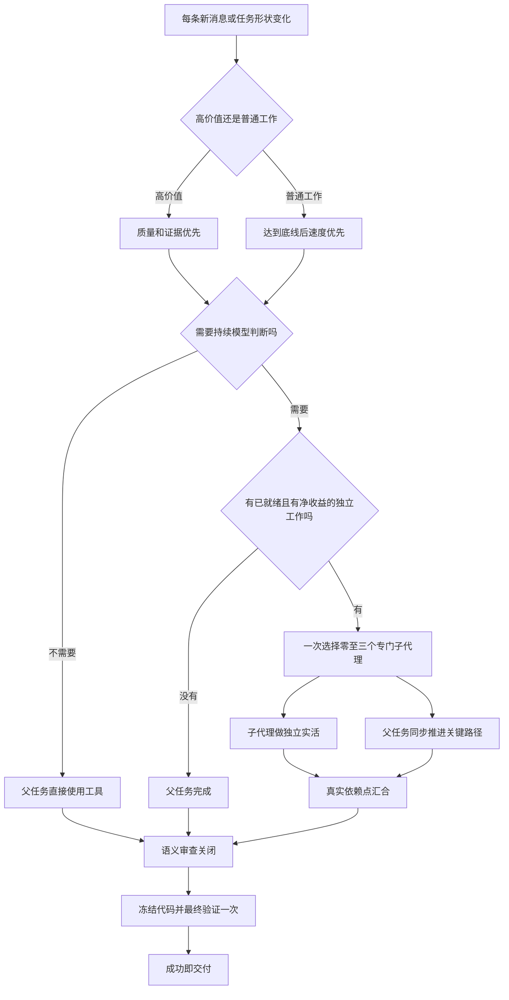

# 精益任务栈

内部插件名：

```text
codex-lean-stack
```

目标只有一个：让父任务和真正合适的专门子代理以更高质量或更短总时间完成真实工作，
同时避免启动、重复读取、等待、汇合、验证和返工吞掉收益。

## 三项原则按工作价值排序

- **高价值工作质量优先。** 安全、权限、数据完整性、迁移、公共契约、复杂根因、
  重大架构和不可逆外部影响先追求正确性与证据；可靠性相当时再比较总时间和总成本。
- **普通工作速度优先。** 可逆、确定、低风险且验收清楚的工作，达到安全和验收底线
  后先选总时间最短的路线；时间接近时再选总成本更低的路线。
- **共同底线不变。** 任何工作都不能省略必要的授权、安全、数据保护和诚实证据。

没有实际令牌、额度或墙钟遥测时，只能说“基于任务形状预计更省”，不能把估计写成
已经证实的节省。

成本不能按模型调用次数比较。父任务已经掌握上下文也不等于子代理一定更贵；若独立
工作只需最小任务说明，较低单位成本的合适子代理即使多用一些令牌，完整路线仍可能
更便宜。当前 5.6 系列额度公式和适用边界见
[执行路由](skills/lean-stack/references/execution-routing.md)。

5.6 只是当前示例，不是模型白名单。以后宿主提供更强或更合适的模型时，插件会按
届时的质量证据、官方额度、速度档位和实际任务形状自动纳入比较。

## 快速主链

1. 每条新用户消息、继续、方向调整、队列新增、范围扩展或阶段变化都重新判断。
2. 先判断工作是否需要持续模型语义判断。
3. 几秒的确定性命令由父任务直接运行；多个短命令工具级并发；长但确定的命令放进
   持续终端或后台会话。
4. 只有已就绪、稳定、独立、可验收且有净收益的语义工作才考虑子代理。
5. 一次选择 `0`、`1`、`2` 或 `3` 个，不默认必须派，也不能把零个宣布为整轮固定
   结论。
6. 子代理启动时立即做真实工作；父任务同步推进不重叠的关键路径，只在真实依赖点
   汇合。
7. 先完成会推动修改的语义审查，再冻结相关代码，最后只运行一次必要验证。
8. 用户成功条件一满足就立即交付；代理记忆、压缩、创建和删除都不能阻塞主任务。

## 通俗中文总链路图



全部十四张链路图见
[全部中文链路图](skills/lean-stack/references/flowcharts-zh.md)。

## 工具优先

以下工作默认不启动模型子代理：

- 一两秒到几秒的本地测试；
- 文件枚举、格式检查、哈希比较和退出状态核对；
- 多个可在一次工具调用中并发的短命令；
- 不需要持续判断的构建、下载或等待。

约十五秒只是普通工作的快速经验边界。只有扣除启动、上下文、汇合和核验后仍明显
缩短总时间，才值得委派；高价值工作的独立审查则以质量和证据增益为先。

## 子代理分派

当前已知可见的定制代理确实匹配时直接复用；否则把同一份最小专门任务说明交给可见
的通用执行子代理或代码探索子代理。当前任务不等待新配置加载。

系统内部类型：

```text
worker
explorer
```

每个子代理只获得完成工作所需的最小上下文、精确边界、读写权限、完成条件和证据
要求。除非工作确实依赖，不复制完整会话历史。来源覆盖完整且未变化时，父任务不做
常规完整重读。

同类独立项目可以复制同一运行时角色；单轴变体只改变一个有用轴。高价值工作先比
质量、安全和证据，普通工作达到底线后先比总时间。其他运行时实例结束即消失，最多
持久保留一个真正值得复用的胜出角色。

5.6 系列的三个升级轴必须分开：模型轴按实际需要考虑
`Luna → Terra → Sol`，推理强度只升宿主真实提供的一个相邻档位，速度轴只比较标准
速度档与快速速度档。每升一档立即核验真实收益，已满足成功条件就停止；未来更强
模型按届时官方数据接入模型轴。

## 验证调度

- 迭代阶段：父任务直接运行最窄检查，默认简短输出，失败后才展开详情。
- 语义审查：先关闭可能推动代码变化的安全、契约、架构和最终差异问题。
- 代码冻结：审查关闭后才声明相关边界稳定。
- 最终验证：多个短命令优先在一次工具调用中并发，只运行一次必要检查。
- 重新修改：解除冻结，只重跑受影响检查；未变化来源的通过证据继续复用。

不得让子代理只运行命令并回报退出状态。只有持续语义判断、重要独立复核，或长时间
验证能与父任务真实并行时，才使用验证子代理。

## 简单结果判断

- `good`：已核验且可直接采用。
- `bad`：不可用、证据弱、越界或需要明显返工。
- `severe_bad`：用户明确否定负责结果、出现未授权影响、伪造关键证据，或违反安全
  与权限边界。

不计算数字评分、失败次数、声誉或降级阶段。

## 可选专门代理记忆

普通分派不依赖持久化。辅助脚本只有三个命令：

```text
ensure
improve
delete
```

创建稳定重复角色的示例：

```powershell
py -3 .\skills\lean-stack\scripts\agents.py ensure `
  --role-key qml-binding-diagnostics `
  --display-name "绑定诊断员" `
  --description "重复诊断绑定循环、依赖失效和运行时警告。" `
  --instructions "追踪实际绑定依赖，返回可复核根因和最小处理。" `
  --model gpt-5.6-terra `
  --reasoning-effort high `
  --authority read
```

新建或安全重配只供新任务加载，当前任务不等待。经验只为已验证胜出者去敏追加；摘要
压缩不删除原始经验。永久删除要求台账、精确路径、单一硬链接、受管标记、所有权令牌
和文件哈希全部匹配，没有隔离和恢复。稳定重复角色确实值得未来复用时，自动授权
非破坏性创建、安全重配、胜出经验去敏追加和摘要压缩；永久删除仍要求用户当前明确
提出。严重失败只能停止采用并提出建议，不能自动删除。

数据库仅用于可选专门代理所有权与经验：

```text
<CODEX_HOME>/lean-stack/specialist-memory-v1.sqlite3
```

未知版本、意外结构、忙锁、损坏或不可用文件都会跳过辅助动作，主任务继续。完整细节
见[专门代理记忆](skills/lean-stack/references/specialist-memory.md)。

## 安装

```powershell
git clone https://github.com/Lang45/codex-lean-stack.git ~/plugins/codex-lean-stack
codex plugin add codex-lean-stack@personal
```

安装或刷新后使用一个新的 Codex 任务加载新技能和专门代理表面，不需要重启 ChatGPT。

## 文件结构

```text
.codex-plugin/plugin.json
skills/lean-stack/
|-- SKILL.md
|-- agents/openai.yaml
|-- scripts/
|   |-- agents.py
|   `-- bump_plugin_version.py
`-- references/
    |-- execution-routing.md
    |-- flowcharts-zh.md
    |-- investigation.md
    |-- bug-fix.md
    |-- build.md
    |-- review.md
    |-- delegation.md
    |-- long-running.md
    |-- specialist-memory.md
    `-- versioning.md
tests/
|-- test_agents.py
|-- test_skill_contract.py
`-- test_bump_plugin_version.py
```

## 验证

只运行可能因当前改动失败的检查：

```powershell
py -3 .\tests\test_agents.py -v
py -3 .\tests\test_skill_contract.py -v
py -3 .\tests\test_bump_plugin_version.py -v
```

随后运行官方技能校验、插件校验和差异检查。发布行为、提交、推送和公开操作仍需用户
明确授权。

## 设计来源

最小方案阶梯来自[精益实现来源](https://github.com/DietrichGebert/ponytail)，任务形状、
证据和有界委派借鉴[工程任务栈来源](https://github.com/nicobailon/pstack)。归属说明见
[第三方声明](THIRD_PARTY_NOTICES.md)，仓库许可证见[许可证](LICENSE)。
