# 中文链路图

本文件按当前源码中的独立执行链分图。图的数量没有目标或上限；源码出现、合并或删除一条真实
链路时，对应图也随之出现、合并或删除，不合并成一张难以核对的总图，也不为凑总数拆图。若
图文冲突，以两个技能入口、命中的最小 reference、实际脚本和运行证据为准。

## 主任务链路

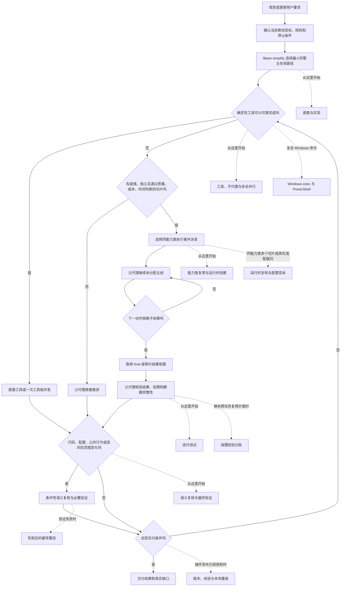

虚线只标记其他链路从主任务链的哪个位置开始。它们完成或跳过后返回主任务，不能成为另一条
取代主任务的主线。经验维护不影响已就绪的主任务动作和交付。

## 工具、子代理与安全并行链路

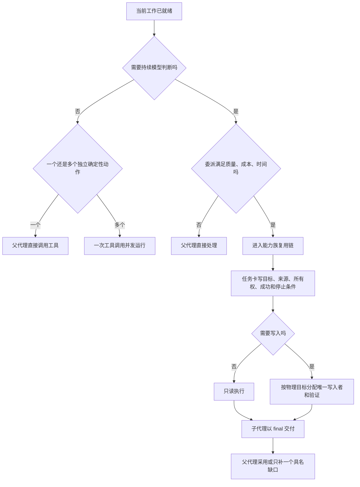

短命令和确定性查询不启动只会代跑命令的模型子代理。多写入者必须遵守
[可写子代理并行](write-parallelism.md)；委派不增加权限或外部副作用。

## Windows exec 与 PowerShell 链路

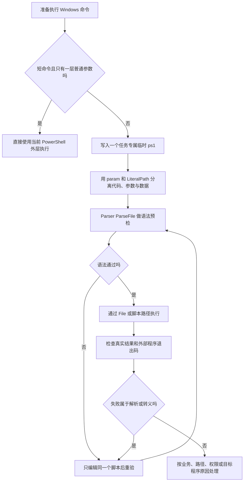

第一次内联失败明确属于解析或转义时，后续只编辑同一个脚本，不连续重写长 one-liner、叠加
转义或换 Shell。完整参数和清理边界见 [Windows exec 与 PowerShell](windows-exec.md)。

## 能力族复用与运行时创建

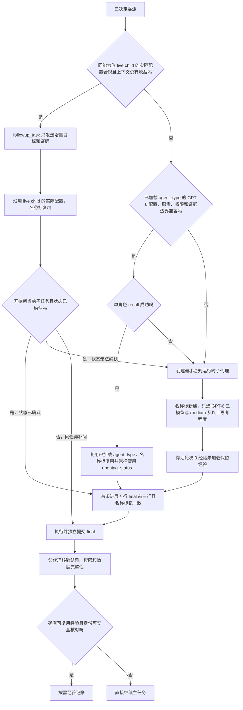

能力族按职责、输入形状、交付、权限、安全风险和证据要求判断。完成状态不妨碍 live child 续用；
项目、框架、动作名称、展示名或模型档位不同不单独创建新角色。

## 运行时复制与配置变体链路

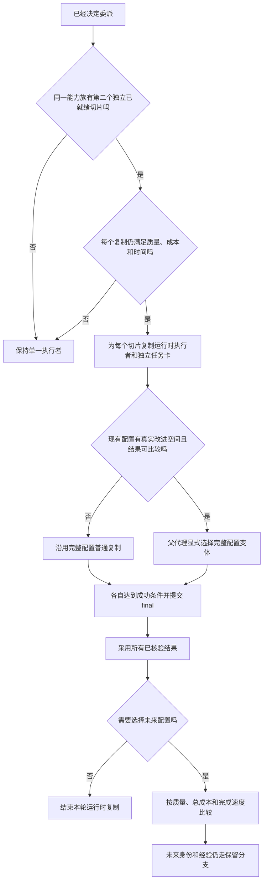

复制和变体只存在于本轮运行，不创建持久候选表，也不丢弃已经核验的互补结果；写同一物理目标
时还须进入 [可写子代理并行](write-parallelism.md)。完整既有语义见
[任务类型组、复制与变体](agent-groups.md)。

## 来源所有权与结果复用链路

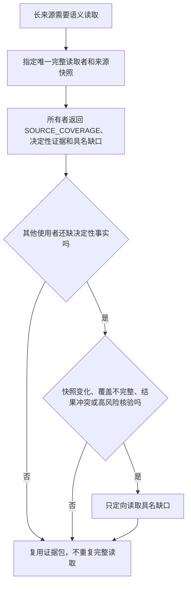

## 可写并行链路

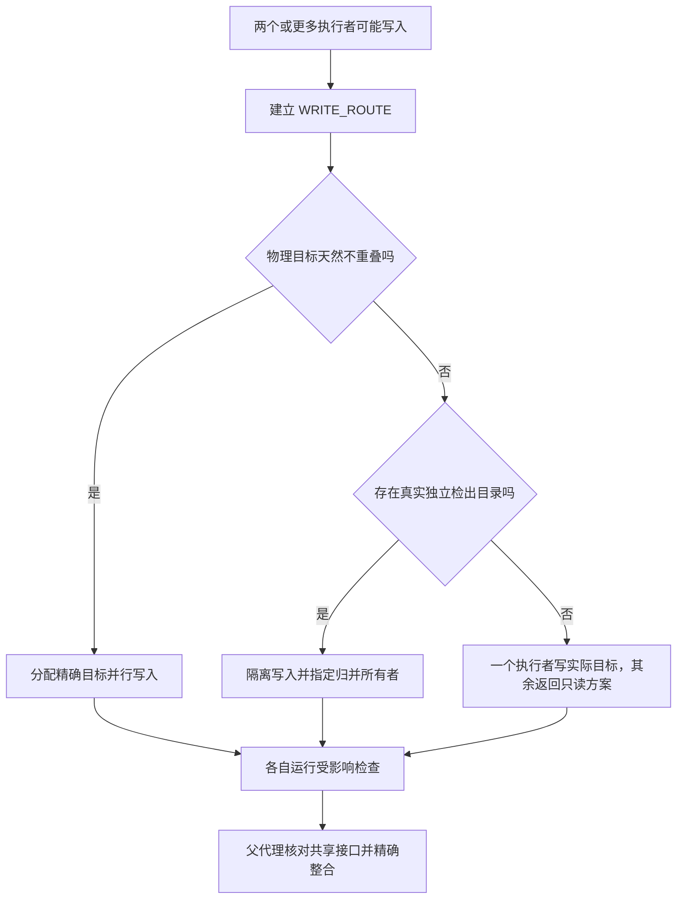

## 协作父代理链路

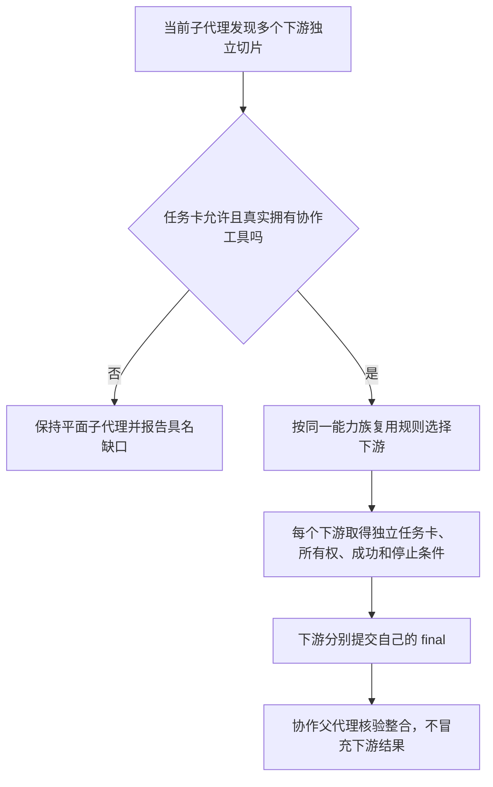

## 调查与实现链路

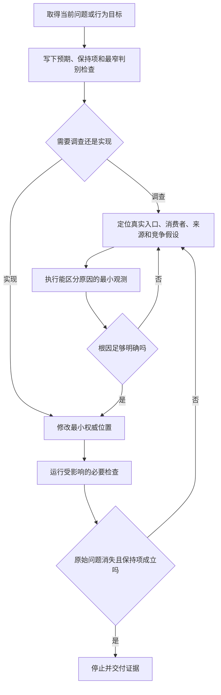

没有新证据时不重复同一补丁或同类检查。能由真实入口决定的问题不靠静态同义字符串代证。

## 迭代测试链路

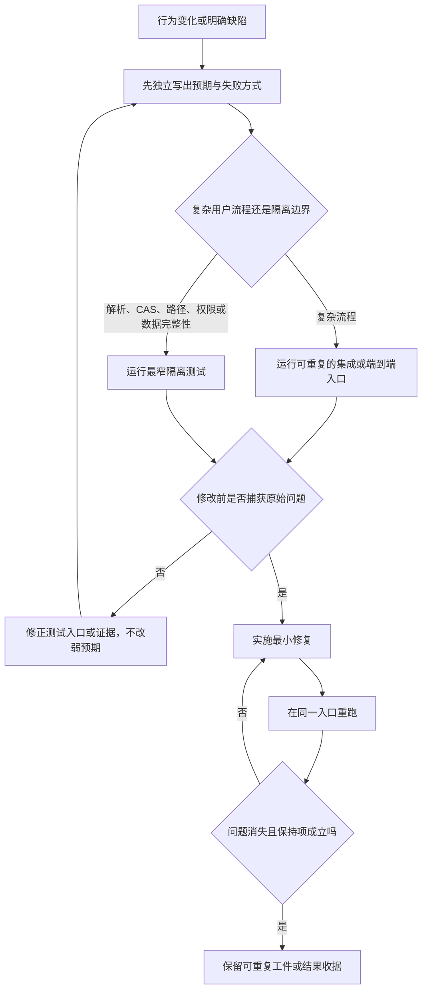

## 语义复核与最窄重验链路

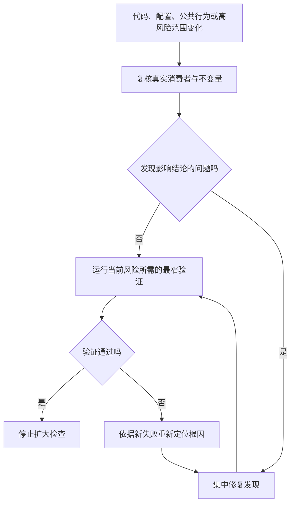

代码、依赖、配置和环境未变化时可复用已通过证据。安全、数据完整性、权限和公共合同所需验证
不得因精简而省略。

## 成本基线维护链路

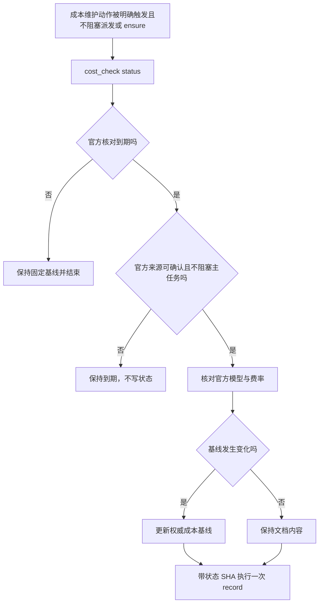

## 保留身份创建与重配链路

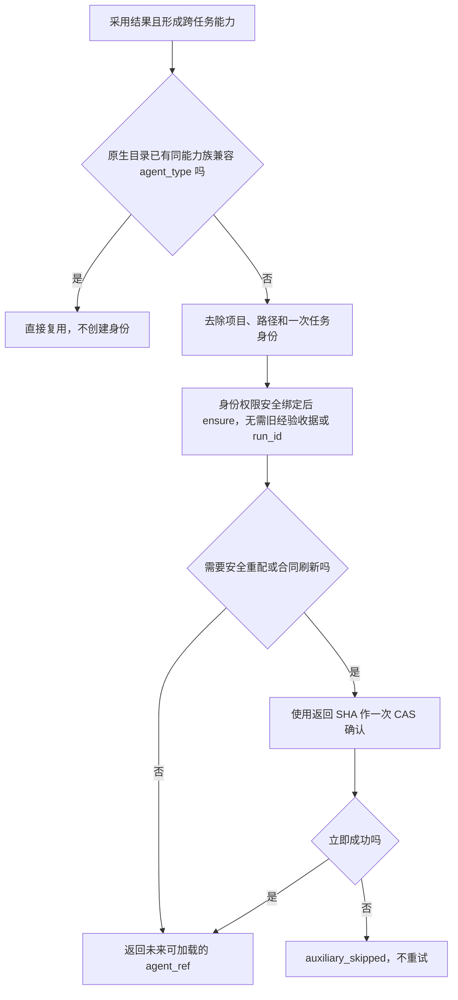

## 按需经验记账与摘要压缩链路

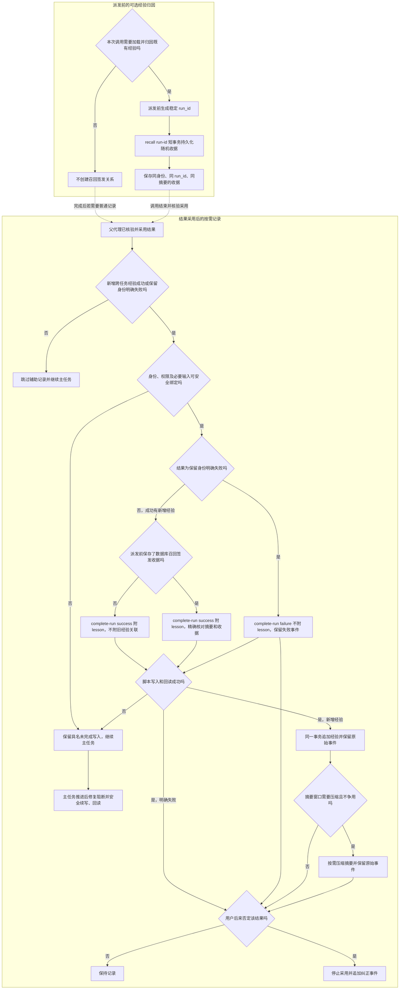

召回签发只能在派发前发生；没有当时保存的数据库收据，就不能在完成后补造经验关联。无新增经验的成功结果不执行 `complete-run`；保留身份明确失败可不带 `--lesson` 记录。未采用、用户否定或无法安全去敏时不写经验。运行中、中断、停止或结果未定不记为失败。写入失败由父代理保留具名续做项，主任务推进后修复实际阻断并回读，不把报告原因当成完成。

## 现实旧状态迁移链路

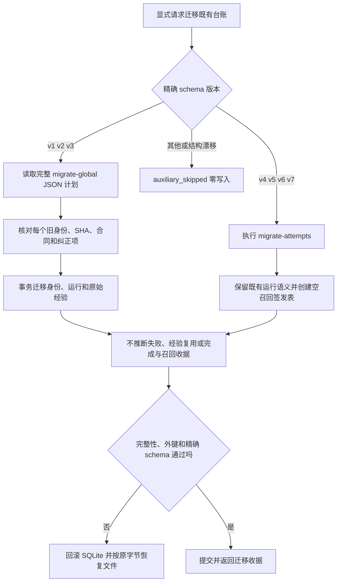

迁移没有普通自动入口。历史运行不能因为当前摘要、相同正文或事件标识而补造调用前签发事实。

## SQLite 结构拒绝链路

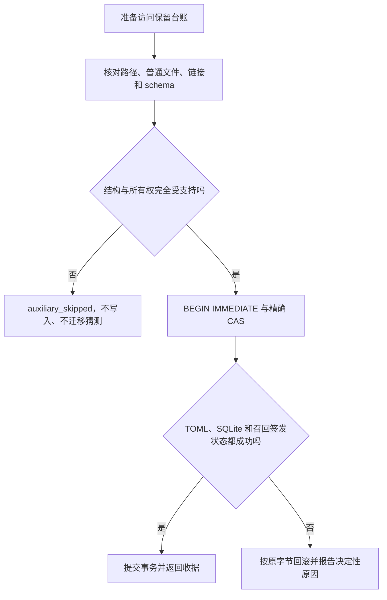

完整迁移、重放、删除和经验事件语义由 `agents.py` 及其行为测试承载，不复制进普通调用链。

## 版本、安装与正式宿主验收链路

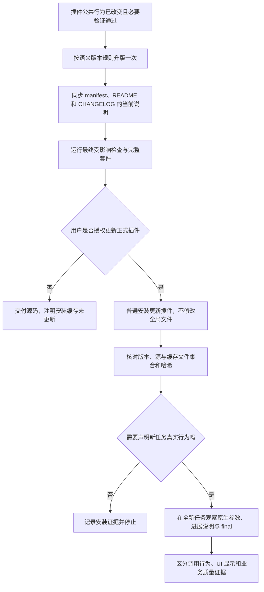

只有用户另行明确批准准确文字时，辅助安装器才修改全局调用入口；更新插件本身不需要改全局
`AGENTS.md`。
