# 中文链路图

本文件以流程图形式说明当前执行链。图的数量不是
目标；是否保留一张图，只看它是否解释当前代码或规则中的独立链路。功能完整性以技能
正文、实际脚本、测试和运行证据为准。本文件只是代码和规则的辅助说明。

“Codex子代理调用与精简流程”插件提供两条并行功能。第一链说明汇合；第二链的直接工具、工具
并发、持续终端和 PowerShell 路径由两个入口共同遵守，其中需要持续模型判断后的子代理分支，
以及第三至五、第七和第十至十二链属于 `$lean-stack` 子代理调用；第六、第八、第九和第十三链
属于 `$lean-simplify` 主任务精简。第七链的迭代测试只决定工具或子代理调用路线；主任务该测什么和受影响范围由主任务精简
确定。两条线各自验收、互不代证，也不会让所有任务固定经过全部分支。`agents.py` 的角色、经验
和摘要维护不是主任务精简执行器。

子代理调用固定按质量、成本、时间判断：先守必要质量和决定性证据，再比较两条完整路线的资源
成本；墙钟时长、等待和并行重叠不计入资源成本。资源成本没有显著差异或都处于可接受成本带时，
再比较关键路径。模型价差足够大时，少量
低成本并行若没有显著增加资源成本且能明显缩短关键路径，可以接受。安全、权限、数据完整性、
验收条件和诚实证据始终是底线。
精简候选则按真实消费者、受保护核心、维护面变化与同一组前后验收判断；模型成本不能替代
精简采用证据。
只有代码、配置、公共行为或高风险范围变化时，才进入条件性语义复核。
英文 `instance` 在中文节点中统一写作“子任务”。同一种活按可复用能力族判断；项目、框架、
动作动词、交付名称和一次性成功条件不另建窄组。工具、写入权限、安全风险或决定性证据形状
不兼容且能独立复用时才建立不同组；范围放宽不授予只读角色写权限。
父代理正向识别可替代自己阅读、实现或分析的独立切片，不把子代理限定为边角工作或审查；
直接处理判断只对当前任务形状有效，形状改变后在继续大块父代理工作前重判。四模型与
`MODEL_ROUTE` 的唯一详细规则见[执行路由](execution-routing.md#四模型一次联合选配)：Luna
处理清楚易验切片，Terra 处理有限语义歧义，Sol 负责复杂端到端工作；Astra 只处理最强可行
GPT-5.6 仍有决定性差距的当前专家问题，普通视觉任务不触发，派出的 Astra 最高 `xhigh`。
持续的多工作流任务一旦出现多个互不依赖、已就绪且能替代父代理研究、实现或验收的切片，
就依据维护后的模型价差及完整父子反事实路线，在降低资源成本或仍处可接受成本带并缩短关键
路径时，于父代理深入读取额外来源族或开始实现前派发全部互不冲突的
合格切片。数量随真实工作流、边际收益与容量变化，不设最低数量。真实依赖、输入未就绪、权限、
写入冲突、重复工作、容量或无必要质量收益的显著增费等只作为内部硬性限制，不增加面向用户的
阻断说明负担；只在后期增加一次复核不能替代前面的实际工作。
父代理的 ultra 不自动传给子代理，具体选配与配置证据见
[执行路由](execution-routing.md)。每个子代理完成后都在自己的线程用
最终回复提交自己的精炼结果；只有中间结果真正解锁下一动作的关键步骤才发一条短消息并立即
继续，父代理无异议可沉默，有问题立即纠偏。每次启动新的当前子任务时，子代理第一条可见
commentary 必须以本地化名称、模型、思考程度和速度四行开头，前面不出现计划、运行 ID 或其他
说明；最终回复顶部再次写实际配置。普通任务不向父代理重复发送相同四行，也不索要确认；内部消息只用于真正解锁下一动作的证据、输入纠偏、风险或
阻断。每个不同任务类型组的唯一结果通过必要核验并被父代理采用后，
第一次成功就默认尝试跨任务保留一个休眠配置并追加一条去敏、非重复的可复用经验；不要求
重复、未来用途证明、主任务接近结束或并行窗口。只有未通过或未采用、用户否定、无法安全
去敏，或者权限、安全、SQLite、文件、身份、CAS 失败才跳过并写明原因。不同任务类型组可以
同时保留多个，当前运行线程仍正常进入 Done。
安全重配只影响以后新生成的代理线程；重配前旧线程不会刷新提示，不能用 `followup_task`
复用旧线程来证明新通信规则。
持久提示的第一段先说明角色、职责和权限，第二段才写通信规则；这只是静态提示结构，不规定
运行时动作顺序。角色 TOML 不能替父会话授予工具；窄保留角色使用
`[skills] include_instructions = false`。
只有子任务确实需要中途内部消息时，父代理才在首次选配前核验模型目录与多代理能力；已知
Luna 目录为 v1 或缺少内部通道时，只分配自包含工作，中途协作任务直接选择具备能力的合适
GPT-5.6 组合。直接调用失败时停止受影响路线；不能为补消息提高模型或成本，也不能用跨任务
API 冒充。
默认使用平面子代理；只有任务卡明确写出协作父代理、允许下游委派和有限下游范围，而且当前
子代理真实拥有 `collaboration.spawn_agent` 时，才可在同一主任务内协调下游子代理。调用其他
或新建 Codex 父代理任务已获当前用户持续授权；符合三项原则、服务主任务、范围清楚且不涉及
未获明确要求的永久删除时可直接进入，并指定唯一整合父代理。任何路线都不
建立非授权留言板，不共享凭据，不以无人否决当批准，也不伪造或隐藏消息、工具、测试和来源。
任务明确成功且结果经采用、线程 Done 后，用 UUID 记录成功存活轮次；整个任务有决定性失败
结论时记录失败，累计第二次失败后永久移除该角色 TOML、身份、全部运行、经验、纠正和摘要。
运行中、中断、停止、否定、未采用或结果未定
都不记录。

本文件是当前 13 条 Mermaid 链路的权威规则内容源，不是 Viewer 实现或交付物。需要离线
静态 SVG/HTML 时，直接调用独立 `architecture-viewer` 插件的 `$architecture-viewer`；需要
原生交互式 Viewer、路径探查、透镜、故事、演示或导出时，调用同一插件的 `$archify` 并要求
`zh-CN` 与全中文创作内容。本插件不保存 HTML/SVG 产物、页面请求、渲染器、Viewer Runtime
或 loopback 预览服务。

## 一、主任务链路

```mermaid
flowchart TD
    A[收到新消息、继续指令<br/>方向、范围、队列或阶段变化]
    A --> A0[首条快速说明当前理解、立即动作和必要限制<br/>随后继续，不等待确认]
    A0 --> A1{有未完成，或已完成<br/>但尚未交付的活动要求吗}
    A1 -->|没有| A2[新要求成为活动锚点<br/>“继续”不复活已交付事项]
    A1 -->|有| A3{当前消息属于哪类}
    A3 -->|取消、停止、放弃或替换| A4[只移除或替换指定项]
    A3 -->|纠正、追加或新要求| A5[只更新对应项<br/>仅重新打开真正受影响的已交付项]
    A3 -->|继续或状态询问| A6[只恢复或说明剩余活动项]
    A2 --> A7[已完成且已交付的要求退出<br/>锚点移到最早剩余项]
    A4 --> A7
    A5 --> A7
    A6 --> A7
    A7 --> B9[$lean-simplify：为主任务步骤选择<br/>最小完整路径]
    B9 --> C
    B9 -. 当前步骤出现可独立模型切片时消费调用能力 .-> B0[$lean-stack：父代理判定具体任务类型]
    B0 --> BL{当前任务形状是否出现变化，或持续多工作流任务已出现<br/>多个独立就绪模型切片吗}
    BL -->|否| C
    BL -->|是| BM{当前切片是否就绪、范围明确、可安全独立<br/>预计达到必要质量且能替代父代理实际工作}
    BM -->|否| BO[父代理完成或等待真实前置]
    BM -->|是| BP[依据维护后的模型价差和完整父子路线<br/>直接作出正向总成本收益判定]
    BP --> BQ{是否命中内部硬性限制}
    BQ -->|是| BO
    BQ -->|否| BN[在额外来源族深入读取<br/>或开始实现前派发全部当前合格 GPT-5.6 切片]
    BO --> C{当前剩余工作价值}
    BN --> C
    C -->|高价值工作| D[必要质量、正确性和决定性证据优先]
    C -->|普通工作| E[先达到质量与证据底线]
    D --> F{确定性工具可以直接完成吗}
    E --> F
    F -->|是| G[父代理使用工具完成]
    F -->|否| H{有已就绪、范围明确、可安全独立推进<br/>预计达到必要质量且能替代父代理实际工作的<br/>低成本 GPT-5.6 模型任务吗}
    H -->|没有| I[父代理直接完成]
    H -->|有| J[依据维护后的模型价差和完整父子路线<br/>直接作出正向总成本收益判定]
    J --> K[立即按实际可用容量调用子代理]
    K --> K1[父代理派发成功条件和停止条件<br/>仅真实依赖设置关键步骤]
    K1 --> K2[子代理在自身 commentary 公开四行配置<br/>最终回复再次保留]
    K2 --> KD{任务确实依赖<br/>中途内部消息吗}
    KD -->|否| L
    KD -->|是| KT{当前组合实际<br/>支持内部消息吗}
    KT -->|是| L
    KT -->|否| K2B[停止受影响路线<br/>自身线程报告能力缺口]
    L[子代理执行当前子任务<br/>普通进展不重复发送]
    K2B --> L1
    K1 --> M[父代理同步推进主任务]
    L --> L0{达到成功条件<br/>或停止条件了吗}
    L0 -->|没有，真实依赖已解锁或发现新风险| LP[子代理发送一条短消息后立即继续<br/>不等待确认]
    LP --> L
    LP -. 父代理异步快判 .-> LC{方向、范围、证据<br/>权限或目标有问题吗}
    LC -->|没有| M
    LC -->|有| LU[立即纠偏或更新当前目标<br/>不扩权、不移除停止条件]
    LU --> L
    L0 -->|是| L1[子代理返回可见信息]
    L1 --> L1A{有明确最终回复<br/>或可采用结果收据吗}
    L1A -->|有| L2[父代理分别接收并核验<br/>不轮询、不为收齐而等待全部]
    L1A -->|没有| L1B{只缺一个具体交付项<br/>且尚未补问吗}
    L1B -->|是| L1C[只做一次明确补问<br/>不要求重读或重做]
    L1C --> L1
    L1B -->|否| L1D[说明未采用原因后关闭或改路<br/>不全面重做]
    L1D --> M
    L2 -. 预计降低后续总成本或提供必要质量且不阻塞 .-> LPR[并行启动有限只读经验准备<br/>泛化角色、去敏，不写 SQLite、不等待]
    L2 --> N{下一步真正依赖结果了吗}
    M --> N
    N -->|还没有| M
    N -->|是| O[父代理核验并处理当前所需结果]
    G --> P{代码、配置、公共行为<br/>或高风险范围变化吗}
    I --> P
    O --> P
    P -->|没有| Q[按任务需要直接收口]
    P -->|有| R[只做会推动修改的条件性语义复核]
    R --> S[修复真实发现并运行必要验证]
    S --> S1{必要验证通过吗}
    S1 -->|否| V
    S1 -->|是| C0[本组当前已就绪结果已核验<br/>进入任务类型组收口]
    Q --> C0
    C0 --> C1{本任务类型组<br/>出现复制或变体吗}
    C1 -->|是| C2[竞争并选出<br/>唯一留下的子代理]
    C1 -->|否| C4[确认组内原本唯一的子代理]
    C2 --> C4
    C4 --> C4A{结果核验采用<br/>且没有明确排除项吗}
    C4A -->|是| C4B[第一次成功默认只尝试一次 ensure<br/>每个不同组保留一个休眠配置]
    C4A -->|否| C5S[角色和经验跳过<br/>保存回执写明原因]
    C4B --> C4E{本次短写能立即<br/>安全完成吗}
    C4E -->|否| C5S
    C4E -->|是| C4R[成功条件达到、结果核验采用且线程 Done<br/>UUID record-run --outcome success]
    C4R --> C5A{有新增、去敏、非重复的<br/>可复用经验吗}
    C5A -->|是| C5[复用稳定 event_id<br/>一次 improve 合并追加一条经验]
    C5A -->|否| C5N[经验跳过<br/>保存回执写明原因]
    C5S --> C6{刚才发生竞争吗}
    C5 --> C6
    C5N --> C6
    C6 -->|是| C7[其他子代理移出组、结束<br/>并从运行时候选中消除]
    C6 -->|否| C3[组内保持一个子代理]
    C7 --> C3
    C3 --> T{当前活动要求达到<br/>本次交付条件吗}
    T -->|是| U[复核本次新完成但尚未交付的结果<br/>以及仍未完成或受阻的活动项]
    U --> W{当前结果和剩余事项<br/>是否都已说明}
    W -->|是| X[交付当前结果<br/>已报告完成项退出，锚点自动前移]
    W -->|否| V[只处理真实缺口]
    T -->|否| V
    V --> F

    F -. 从这里开始 .-> AUX2[辅链二：工具、子代理与安全并行]
    H -. 从这里开始 .-> AUX3[辅链三：调用容量与成本快判]
    C3 -. 到期且能非阻塞并行时 .-> AUX4[辅链四：固定成本预估与每周检查]
    K -. 从这里开始 .-> AUX5[辅链五：任务类型组、复制与变体]
    D -. 工作类型确定后 .-> AUX6[辅链六：调查与实现]
    E -. 工作类型确定后 .-> AUX6
    B9 -. 独立进入预防检查或显式消融 .-> AUX6
    O -. 产生修改后 .-> AUX7[辅链七：迭代测试]
    P -. 有风险范围变化时 .-> AUX8[辅链八：语义复核与最终验证]
    S1 -. 验证失败时 .-> AUX9[辅链九：失败后的最窄重验]
    LPR -. 只做准备，不阻塞主任务 .-> AUX10[辅链十：跨任务保留、经验转移与摘要]
    C4 -. 展开默认持久提交，返回后再到 C6 .-> AUX10
    AUX10 -. 打开 SQLite 前 .-> AUX11[辅链十一：SQLite 结构拒绝]
    C7 -. 经验维护完成或跳过后才开始 .-> AUX12[辅链十二：组收口、精确删除与否定重做]
    C3 -. 当前任务属于插件发布时 .-> AUX13[辅链十三：版本、校验与本地重装]
```

子代理链路只展开这里的同一次判断，不得再次增加调用前置条件。`$lean-stack` 适用后，插件规则是
调用判断和后续选路的唯一业务规则；不套用或引用官方默认调用触发规则。`$lean-simplify` 可按
第六链独立执行，只有复杂精简任务另行通过子代理收益判断时才同时使用两者。中途调整只更新
对应活动项，处理后继续其他剩余要求；已经完成并交付的事项退出清单，不被“继续”或无关纠正
复活。最终说明只覆盖本次尚未报告的结果和当前剩余事项。图中
虚线只标记其他链路从主任务链的哪个位置开始；辅助链完成或跳过后仍回到主任务下一步，
不能成为另一条取代主任务的主线。辅链十可以在主任务测试前从 `LPR` 提前准备，但不写
SQLite、不等待；唯一子代理确定且结果核验采用后，从 `C4` 默认做一次有限保留和一次经验
提交，返回后进入 `C6`。准备未开始或未赶上不能取消默认提交；其他子代理不会在持久提交和
经验维护完成或安全跳过前移出组。

## 二、工具、子代理与安全并行链路

```mermaid
flowchart TD
    A[父代理已判定一个具体任务类型] --> B{需要持续模型判断吗}
    B -->|不需要| C0{PowerShell 命令需要复杂转义吗}
    C0 -->|不是或不需要| C{确定性工具形状}
    C0 -->|需要| PS[写入任务专属临时 .ps1<br/>后续编辑同一脚本]
    C -->|几秒| D[父代理直接运行]
    C -->|多个独立短命令| E[一次工具调用并发运行]
    C -->|长但步骤确定| F[持续终端或后台运行]
    D -. 首次解析或转义失败 .-> PS
    PS --> PS1[param() 接收普通参数，路径优先 -LiteralPath<br/>不写秘密、不进入仓库]
    B -->|需要| G{一次调用判断通过吗}
    G -->|否| H[父代理完成或等待真实前置条件]
    G -->|是| I[进入任务类型组链路<br/>确定复用或定制的当前子代理]
    I --> J{当前是可见保留子代理吗}
    J -->|是| JR[保留子代理读取自己的<br/>经验和已有配置]
    J -->|否| JN[父代理定制运行时新子代理<br/>选择并写入具体配置]
    JR --> K0[任务说明含成功条件、停止条件和协作范围<br/>仅真实依赖设置关键步骤]
    JN --> K0
    K0 --> KR{任务卡明确允许下游委派<br/>且子项目有多个已就绪独立切片吗}
    KR -->|否| KC
    KR -->|是| KP{子代理实际有<br/>collaboration.spawn_agent 吗}
    KP -->|没有| KPS[停止协作父代理路线并报告缺口<br/>由整合父代理改走平面路线]
    KP -->|有| KPC[当前子代理成为协作父代理<br/>只在下游范围内分派]
    KPC --> KC
    KPS --> O
    KC{任务确实依赖<br/>中途内部消息吗}
    KC -->|否| K
    KC -->|是| KM{当前组合实际<br/>支持内部消息吗}
    KM -->|是| K
    KM -->|否| KS[停止受影响路线<br/>自身线程报告能力缺口]
    K[自身 commentary 公开四行配置<br/>最终回复再次保留]
    K --> L[子代理开始真实任务<br/>普通进展不重复发送]
    KS --> O
    L --> M[父代理同步推进主任务]
    L --> LK{当前是协作父代理吗}
    LK -->|否| L0
    LK -->|是| LKP[给下游子代理分别派发任务卡<br/>各自在自己的线程提交独立结果]
    LKP --> L0
    L0{达到成功条件<br/>或停止条件了吗}
    L0 -->|没有，真实依赖已解锁或发现新风险| L1[发送一条短消息后立即继续<br/>不等待确认]
    L1 --> L
    L1 -. 父代理异步快判 .-> L2{发现方向问题吗}
    L2 -->|没有，保持沉默| M
    L2 -->|有| L3[立即纠偏或更新当前目标<br/>仍守住权限和停止条件]
    L3 --> L
    L0 -->|是| N{子代理需要写入吗}
    N -->|只读| O[最终回复顶部再次写实际配置<br/>提交精炼证据或结果]
    N -->|需要写入| P{写入范围能天然分开吗}
    P -->|能| Q[分配不重叠范围并行写入]
    P -->|不能| R{有真实独立检出目录吗}
    R -->|有| S[候选在隔离目录写入]
    R -->|没有| T[一个候选写实际目标]
    T --> U[其他候选只返回方案、补丁或证据]
    Q --> V0[每个可写子代理在自己的线程<br/>提交自己的精炼结果]
    S --> V0
    U --> V0
    V0 --> V[共同热点最后集中整合一次]
    O --> W[第一处真实依赖点汇合]
    V --> W
    M --> W
    W --> X[父代理核验证据、权限和真实修改范围]
    X --> Y{有越界、重叠或基线变化吗}
    Y -->|有| Z[停止覆盖并按当前差异重新整合]
    Y -->|没有| AA[运行受影响检查并继续主任务]
    Z --> AA
    D --> AA
    E --> AA
    F --> AA
    PS1 --> AA
    H --> AA
```

多个可写子代理可以并行，这不是单写入者规则；同一物理文件没有真实隔离时只允许一条
直接写入路线。子代理第一条可见 commentary 必须以本地化名称、模型、思考程度和速度四行开头，
前面不出现计划、运行 ID 或其他说明；最终回复顶部再次写实际配置。普通任务不向父代理重复发送相同四行，也不等待确认。只有中间结果真正解锁下一
动作时才设置关键步骤并发送一条短消息；正常过程随最终回复交付。插件不增加认领数据库、
锁租约、定时心跳或后台协调器。任务依赖中途内部交流时才核验对应能力；工具不可用就停止
受影响路线，自包含任务仍可在自身线程继续。
协作父代理只在任务卡明确允许、真实工具可用且下游范围能隔离时出现；它可以核验并整合自己
子树的独立结果，但不能压掉、改写或冒充下游最终回复。跨任务调用或新建 Codex 父代理任务
属于用户可见编排，符合三项原则和当前持续授权时可直接进入，并指定唯一整合父代理；
`send_message_to_thread` 不能冒充内部 `collaboration.send_message`。完整规则见
[协作父代理与父代理之间](collaboration.md)。

简单 PowerShell 仍内联；多层引号、嵌套 JSON 或正则、反引号、多行逻辑和复杂变量插值在
首次执行前改用任务专属临时 `.ps1`。第一次内联失败若明确是解析或转义问题，就停止改写
one-liner 并只编辑同一脚本；业务错误按真实原因处理。临时脚本不含秘密、不进入仓库，清理
时按既有规则进入 Windows 回收站或任务专属 `待删文件`，不另建通用执行器或重试系统。

## 三、调用容量与成本快判链路

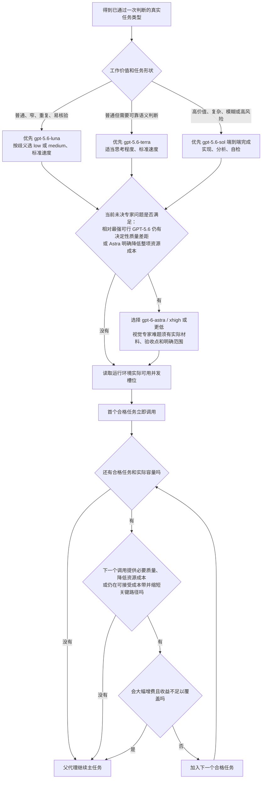

插件不设置同时调用数字，也不设置主任务累计调用数字。容量是上限，不是调用目标；固定
成本预估既提供普通任务的低成本正向选路，也阻止没有必要质量收益的大幅增费；不逐任务搜索
费率、计算令牌或制作评分表。某个低成本子任务不达标时只调整该子任务。新选配以标准速度为
基线；完整路线仍在可接受成本带且快速明显缩短关键路径时可以选择快速。

## 四、固定成本预估与每周检查链路

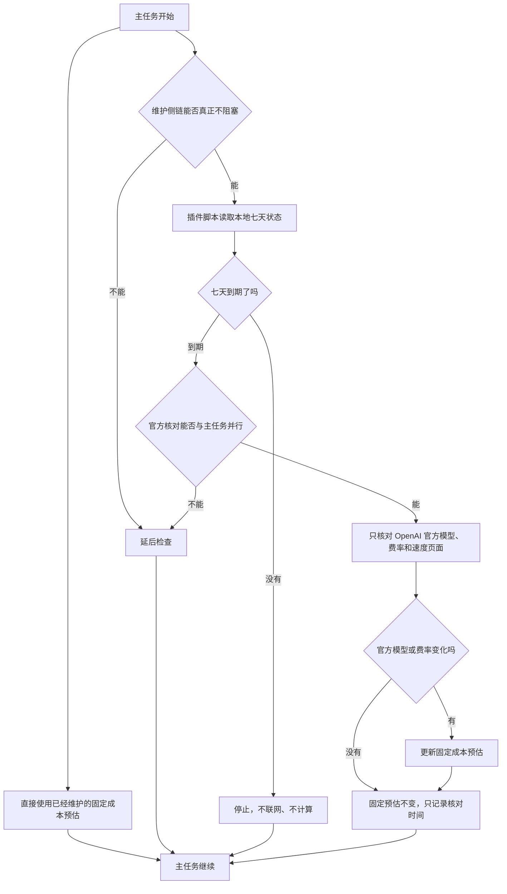

检查不创建 Codex 自动化、系统定时任务、外部守护进程，也不为维护单独调用子代理。

## 五、任务类型组、复制、变体与保留子代理链路

```mermaid
flowchart TD
    A[父代理已判定具体任务类型<br/>并确认应该调用] --> B{具体任务类型适合<br/>已有任务类型组吗}
    B -->|适合| C[立即复用已有任务类型组]
    C --> D{有可见的保留子代理吗}
    D -->|有| E[立即复用保留子代理]
    E --> F[保留子代理读取自己的<br/>经验和已有配置]
    D -->|没有| G[父代理为当前任务<br/>定制运行时新子代理]
    B -->|不适合| H[开新的运行时任务类型组]
    H --> G
    G --> I[父代理按任务类型联合选择<br/>模型、思考程度和速度完整配置]
    F --> J0[父代理为每个子任务分别给出成功与停止条件<br/>只有真实依赖才列关键步骤]
    I --> J0
    J0 --> JC{任务确实依赖<br/>中途内部消息吗}
    JC -->|否| J
    JC -->|是| JM{当前组合实际<br/>支持内部消息吗}
    JM -->|是| J
    JM -->|否| JSTOP[停止受影响路线<br/>自身线程报告能力缺口]
    J[自身 commentary 公开四行配置<br/>最终回复再次保留]
    J --> K[组内子代理开始执行第一个子任务<br/>普通进展不重复发送]
    JSTOP --> U
    K --> L[同一种活按可复用能力族判断<br/>项目、动作和产物不另建窄组]
    L --> L1[父代理为每个子任务<br/>分别指定成功条件]
    L1 --> M{还有第二个或后续<br/>已就绪的同类型子任务吗}
    M -->|有| N[复制任务类型组里的基准子代理<br/>不是复制任务类型组]
    N --> O{可见保留子代理<br/>确有进步空间吗}
    O -->|没有| P[普通复制<br/>沿用已有配置和经验]
    O -->|有| Q[父代理联合选择完整可行配置组合<br/>让本次复制成为变体]
    P --> S{还有第三个或后续<br/>同类型子任务吗}
    Q --> S
    S -->|有| N
    S -->|没有| T[各子代理执行自己的任务<br/>只为真实依赖保留关键步骤]
    M -->|没有| T
    T --> T0{达到各自成功条件<br/>或停止条件了吗}
    T0 -->|没有，真实依赖已解锁或发现新风险| TP[发送一条短消息后立即继续<br/>不等待确认]
    TP --> T
    TP -. 父代理异步快判 .-> TC{发现方向问题吗}
    TC -->|有| TU[立即纠偏或更新当前目标<br/>不扩权、不移除停止条件]
    TU --> T
    TC -->|没有| T
    T0 -->|是| U[最终回复顶部再次写实际配置<br/>提交自己的精炼结果]
    U -. 预计降低后续总成本或提供必要质量且不阻塞 .-> UP[并行启动有限只读经验准备<br/>不写 SQLite，父代理不等待]
    U --> UA[父代理分别核验和使用<br/>不由子代理预先合并]
    UA --> U1[本组当前已就绪结果<br/>已经全部完成必要核验]
    U1 --> U2{本组出现过<br/>复制或变体吗}
    U2 -->|是| U3[全部子代理使用各自核验后的<br/>可比较证据竞争]
    U3 --> U4[选出同一任务类型组<br/>唯一留下的子代理]
    U2 -->|否| U4
    U4 --> V0{本组有配置变体吗}
    V0 -->|没有| W[保留唯一子代理对应的配置]
    V0 -->|有| V{胜出完整配置组合<br/>质量达标后资源成本更低<br/>或仍在成本带且关键路径更短吗}
    V -->|没有| W
    V -->|有| X[选择胜出变体配置作为保留配置]
    W --> Y[唯一子代理和对应配置已经确定]
    X --> Y
    Y --> Z{结果核验采用<br/>且没有明确排除项吗}
    Z -->|否| YSKIP[角色和经验跳过<br/>保存回执写明原因]
    Z -->|是| AB{该任务类型组的<br/>保留记录状态}
    AB -->|不存在| AD[第一次成功默认只尝试一次 ensure<br/>创建休眠配置]
    AB -->|配置相同| AE[复用现有保留子代理]
    AB -->|胜出配置不同| AF[先返回需要安全重配]
    AF --> AG[用当前哈希比较并交换]
    AG --> AH[保留身份、路径、所有权令牌和全部经验]
    AD --> AS{本次短写能立即<br/>安全完成吗}
    AE --> AS
    AH --> AS
    AS -->|否| YSKIP
    AS -->|是| AI[以后新任务生成新线程<br/>加载休眠配置并验证当前所需能力]
    AI --> AIR[结果核验采用且线程 Done<br/>UUID record-run --outcome success]
    AIR --> EX{有新增、去敏、非重复的<br/>可复用经验吗}
    EX -->|是| EI[复用稳定 event_id<br/>一次 improve 合并追加一条经验]
    EX -->|否| ENO[经验跳过<br/>保存回执写明原因]
    YSKIP --> Y2{本组出现过<br/>复制或变体吗}
    EI --> Y2
    ENO --> Y2
    Y2 -->|是| Y3[其他子代理移出组、结束<br/>并从运行时候选中消除]
    Y2 -->|否| Y4[不存在需要竞争移除的子代理]
    Y3 --> Y5[组内只剩一个子代理<br/>运行线程结束并进入 Done]
    Y4 --> Y5
    Y5 --> AC[每个合格任务类型组各有一个休眠配置<br/>不同组可同时跨任务保留多个]
```

定制运行时新子代理不等于持久创建，不先调用 `ensure`。子代理结果可采用且父代理仍要测试
时，只有经验准备预计降低后续总成本或提供必要质量且不阻塞，才可并行启动，不能只因空闲
容量调用；父代理不等待。唯一子代理的结果通过
必要核验并被采用后，第一次成功默认只尝试一次 `ensure`，并用稳定 `event_id` 默认一次
`improve` 追加一条新增、去敏、非重复的可复用经验。当前任务不轮询、不重新加载、不重启；运行线程
结束进入 Done，跨任务保留的是休眠配置。TOML 重配前已经创建的旧线程不会刷新提示；
`followup_task` 复用旧线程不能作为新配置证据，必须由以后新任务生成新线程验证。复制的是
任务类型组里的子代理，不是任务类型
组；复制只处理同一任务类型的第二个及以后子任务。变体只能在复制组内子代理时由父代理按
任务类型联合选择完整的模型、思考程度和速度组合；三个字段可以因相互制约而同时变化，单轴
变化只在明确需要识别因果时作为可选实验。只要
出现复制或变体，就在本组当前已就绪结果完成核验后先竞争并选出唯一子代理，再执行默认跨任务
保留和经验提交，最后才
把其他子代理移出组、结束并消除。不存在竞争的组也在结束位置执行同一经验维护判断。复制
和变体都不写入 SQLite 候选状态；只有真实依赖关键步骤完成时才发一条短消息并立即继续，
普通进展随最终回复交付，父代理无异议时沉默，有问题立即纠偏。达到成功条件或停止条件并自检后，每个子代理在
自己的线程用最终回复提交精炼结果，回复顶部再次写实际模型、思考程度和速度；竞争不延迟或替代
这些结果。
只有任务确实依赖中途内部消息时才确认交流能力；没有内部工具时停止受影响路线并报告运行
环境缺口，不得改用跨任务 API，也不得仅为通信升级模型或增加成本。自包含任务只使用自身
commentary 和最终回复即可继续。结果核验采用并进入 Done
后，才用任务说明中的 UUID 幂等记录一次成功存活轮次；整个任务有决定性失败结论时用独立
UUID 记录失败，累计第二次明确失败后永久移除该角色全部资料，不保留退役记录或恢复入口。
运行中、中断、未采用、用户否定、工具
阻断或结果未定不记录任务结果。无法安全去敏，或者权限、安全、SQLite、文件、身份、CAS
失败时安全跳过经验维护；没有空闲容量、准备未赶上、
没有剩余收口工作或主任务已经满足都不能取消默认单次尝试。父代理最终按组给出保存回执。

## 六、调查与实现链路

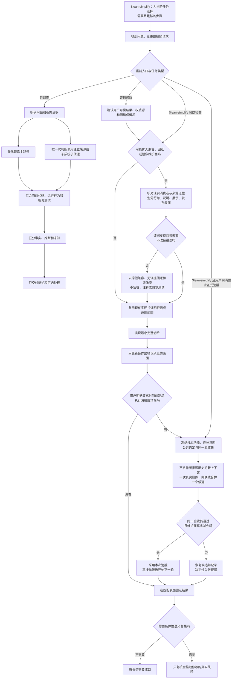

来源覆盖完整且来源未变化时，父代理不重复完整读取。
`$lean-simplify` 可以从预防检查或正式消融节点独立进入，不要求先调用子代理；调用了子代理也
不能替代真实删除、内联或合并以及同一组前后验收。本链承载主任务精简的调查与实现，但只进入当前任务
需要的分支，不把所有节点变成固定阶段。

## 七、迭代测试链路

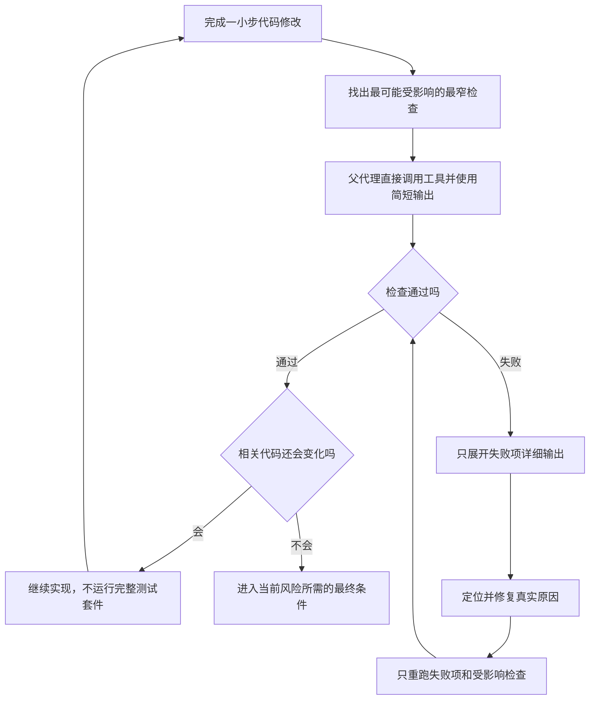

几秒的确定性测试由父代理直接运行；没有独立语义收益时不调用验证子代理。
本链属于 `$lean-stack` 子代理调用；`$lean-simplify` 只提供主任务的检查对象、预期来源与受影响
范围，并消费本链结果。

## 八、条件性语义复核与最终验证链路

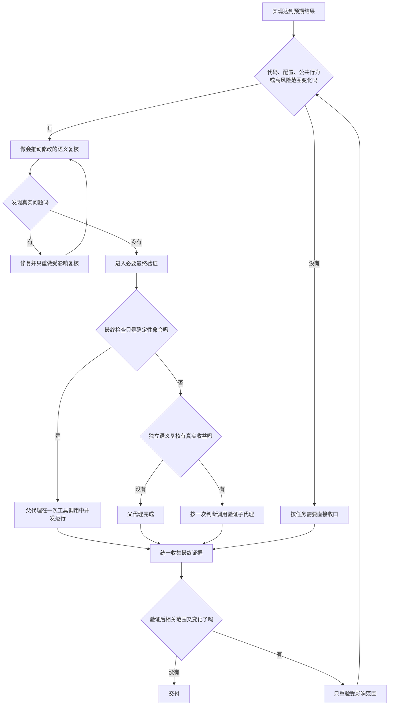

语义复核不是所有主任务固定经过的重点链路。
本链属于 `$lean-simplify` 主任务精简；其中是否调用验证子代理仍由 `$lean-stack` 单独判断。

## 九、失败后的最窄重验链路

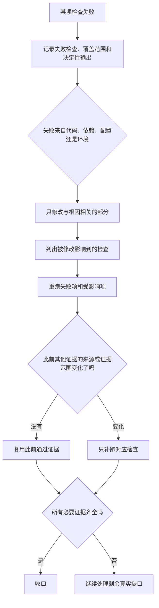

本链属于 `$lean-simplify` 主任务精简；执行时若出现新的模型判断切片，再由 `$lean-stack` 决定
是否委派。

## 十、经验转移、只追加与摘要压缩链路

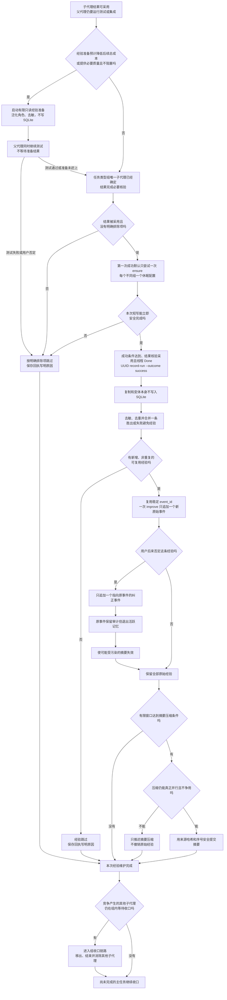

默认保留和原始经验提交不要求主任务接近结束、剩余收口工作或并行窗口；每次只做一次有限
本地尝试，不排队、不轮询、不重试，主任务不依赖成功。准备未开始或未赶上不取消正式提交。
摘要压缩仍只在能真正并行且不争用时执行；推迟摘要不能撤销原始经验。原始经验数量不封顶，
摘要压缩和纠正永不删除原始经验。竞争组先确定唯一子代理，再执行本链；本链完成或安全跳过
之后才移出其他子代理。没有竞争的组也从同一个组结束位置进入本链。

## 十一、SQLite 结构拒绝链路

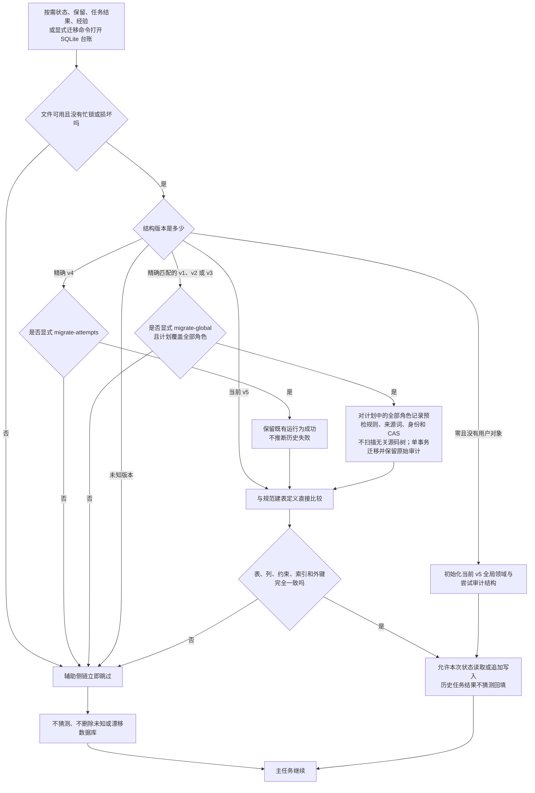

SQLite 不用于认领源码文件、锁定工作区或协调可写子代理。

## 十二、任务类型组收口、精确删除与否定重做链路

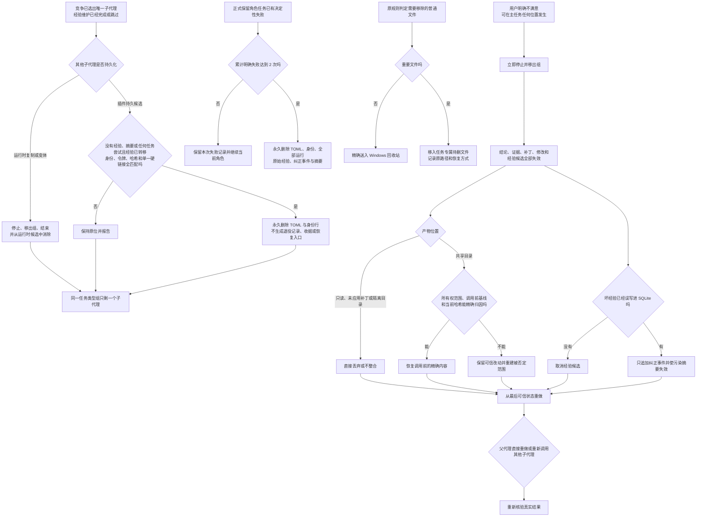

最近的协作授权不改变删除、删减或候选清理尺度。原规则判定应移除的普通文件进入 Windows
回收站，重要文件进入 `待删文件`；插件持久候选仍按经验、摘要、任务尝试、身份、令牌、哈希
和单一硬链接资格判断，合格时永久删除 TOML 与身份行。累计第二次明确失败另行永久删除该角色
的全部运行与经验资料。两条角色路线都不保留退役记录、待删副本、收据或恢复入口。
用户不满意本身不能放宽资格。Codex 已显示的历史文字不能由插件物理删除，被否定内容只能从
当前工作和最终交付中排除。
本链完整属于 `$lean-stack` 的子代理任务类型组与保留角色生命周期。共享目录撤销是用户否定
子代理后的清理步骤，不把本链变成主任务精简能力；角色 TOML、身份、运行、经验和摘要的清理
不能用源码或设计精简候选的删除标准代替。

## 十三、版本、校验与本地重装链路

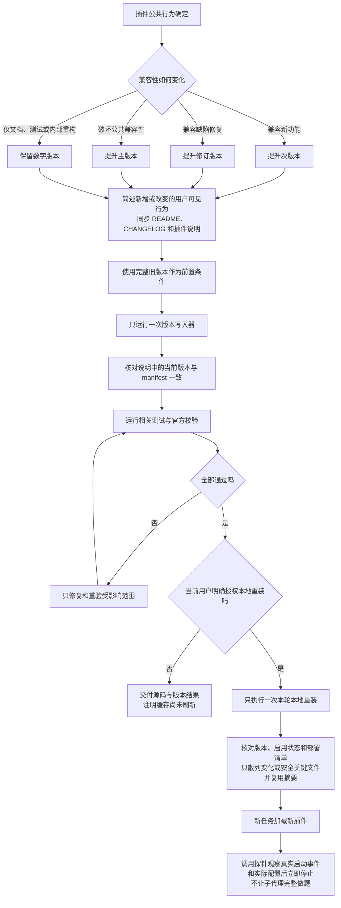

安装缓存属于正式交付清单，必要时可对预先声明的全部部署文件做一次完整散列；同一输入不因
重试再次散列。同一卷内只改变路径的移动不进入这条例外，不建立迁移前后整树长度与哈希清单。

本链属于 `$lean-simplify` 主任务精简；发布和安装仍只在当前授权与项目约定允许时执行。

提交、推送、公开发布、外部消息、修改用户全局 `AGENTS.md` 和重启应用，不由本链路
自动授权。

## 系统标识

普通中文正文使用统一中文术语。必须与运行环境或脚本精确交互时，才单独使用：

```text
worker
explorer
SOURCE_COVERAGE
agents.enabled
agents.max_concurrent_threads_per_session
expected_sha256
run_id
status
ensure
record-run
improve
delete
migrate-global
migrate-attempts
```
