# 全部中文链路图

本文件用通俗中文说明插件的完整执行链。三项原则按工作价值改变顺序：

- 高价值工作：质量优先，其次是总时间，最后是总成本。
- 普通工作：达到安全和验收底线后，速度优先；时间接近时再看总成本。
- 安全、权限、数据完整性和诚实证据始终是底线。

## 一、总任务主链路

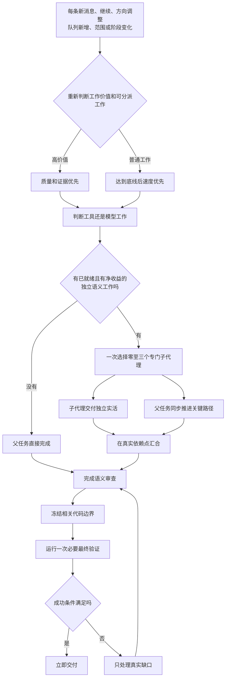

## 二、工具与子代理选择链路

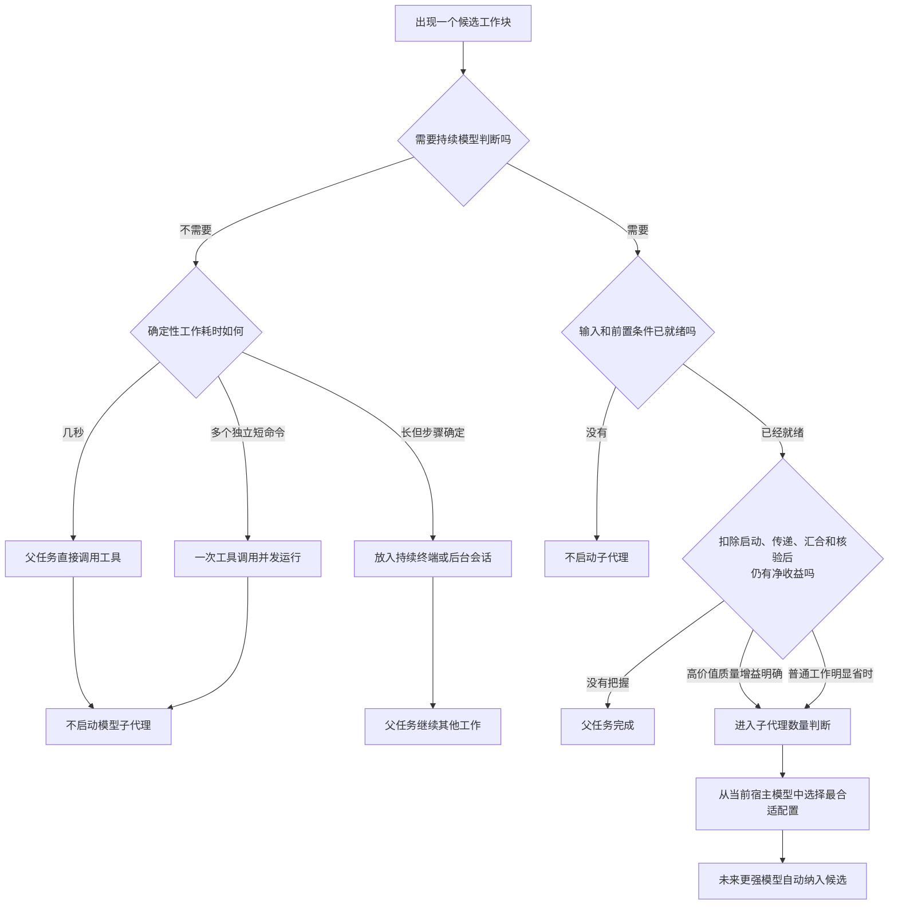

经验边界：普通工作大约只能节省十几秒时，要把子代理启动和汇合开销算进去；这只是
快速判断，不是评分表。

## 三、子代理数量选择链路

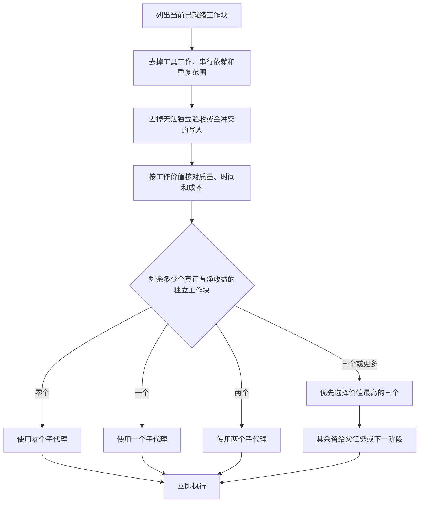

数量没有默认值。零个、一个、两个和三个地位相同，不能为了显得并行而凑数。

## 四、父任务与子代理并行链路

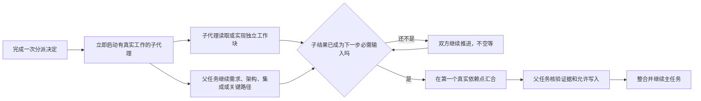

耦合代码和共享状态只有一个写入者；多个可写子代理必须天然拥有互不重叠的目标。

## 五、同类复制与单轴变体链路

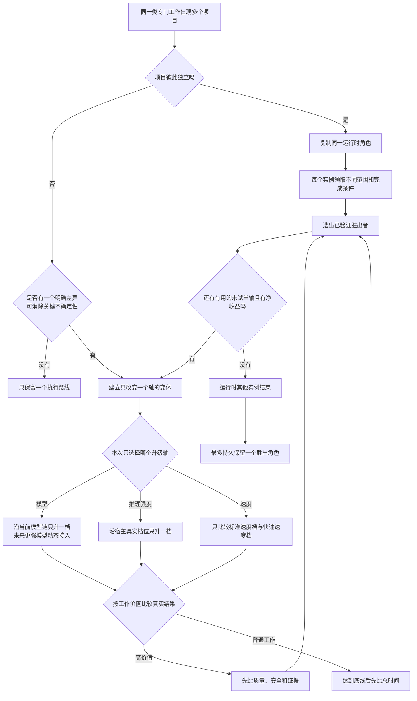

## 六、调查与实现链路

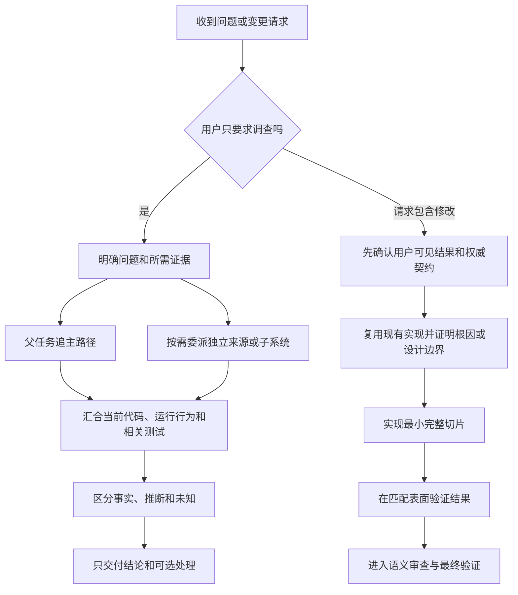

调查子代理完整覆盖且来源未变化时，父任务不做常规完整重读。

## 七、迭代测试链路

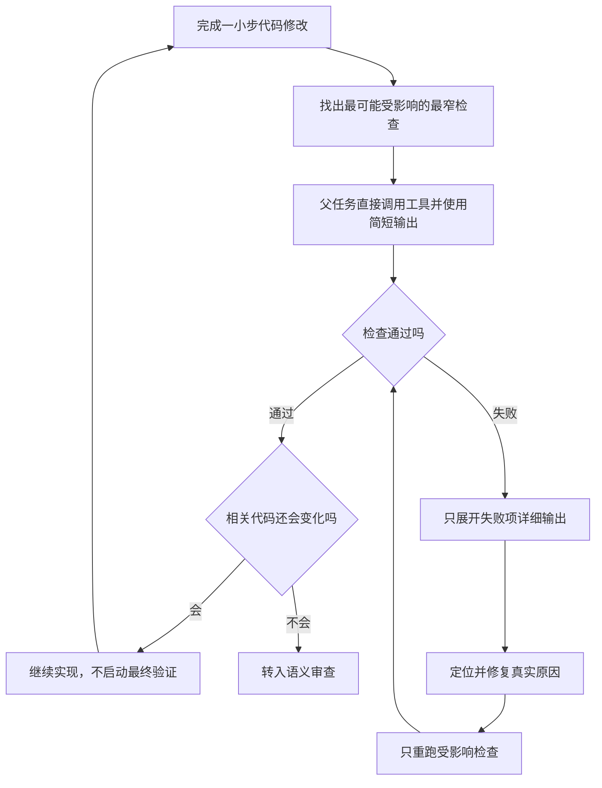

这条链路通常使用零个子代理。几秒的测试由父任务直接运行更快、更省。

## 八、语义审查、代码冻结和最终验证链路

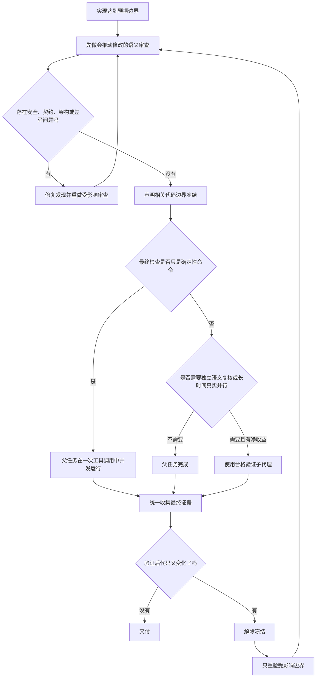

验证子代理不能只运行命令并回报退出状态；它必须提供独立语义判断或证据解释。

## 九、失败后的最窄重验链路

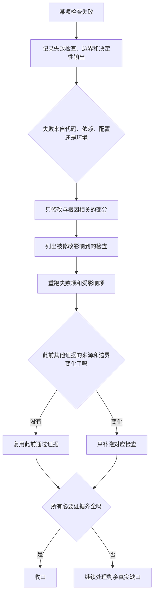

## 十、专门代理创建与安全重配链路

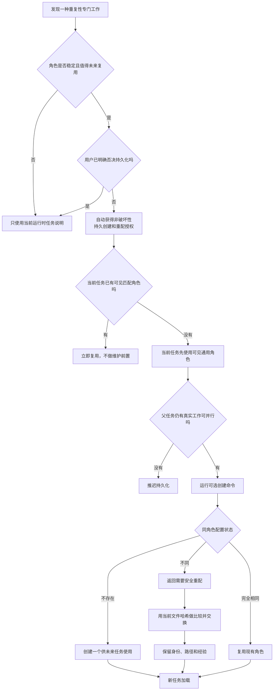

当前任务不等待新配置可见，也不轮询、不重新加载、不重启。

## 十一、经验追加与摘要压缩链路

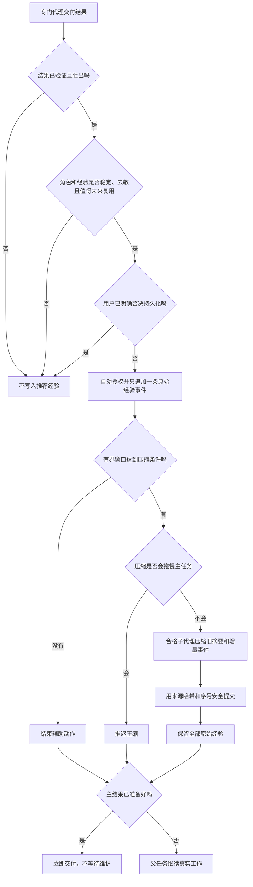

## 十二、数据库结构拒绝链路

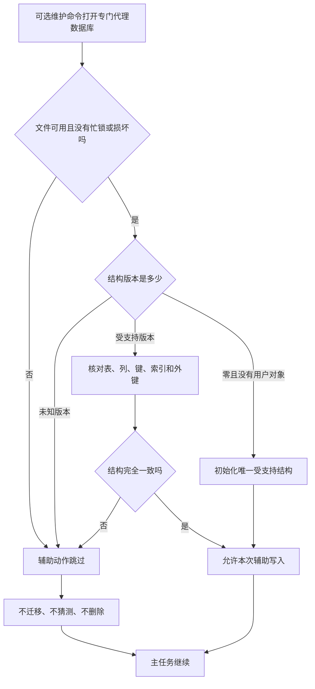

## 十三、永久删除链路

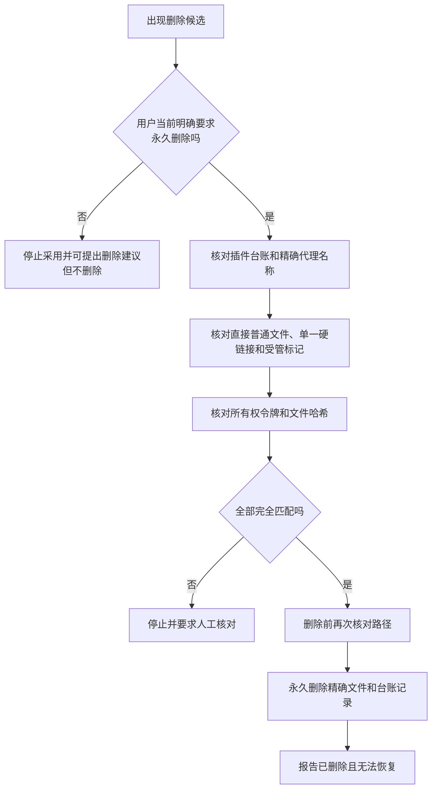

删除不能与另一个代理目录写入者并行，也没有隔离、恢复或状态机。

## 十四、版本提升、单次重装和新任务加载链路

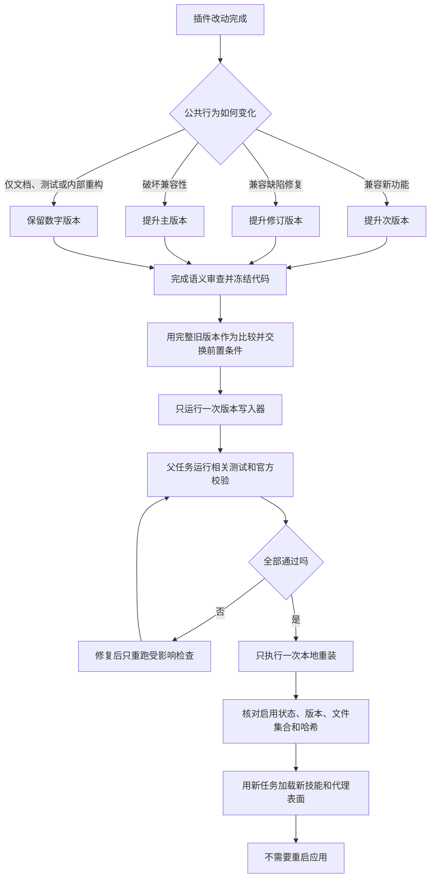

提交、推送、公开发布和外部消息不在本链路的默认授权内。

## 系统标识说明

中文正文使用中文术语。必须与宿主或脚本精确交互时，才单独使用这些标识：

```text
worker
explorer
SOURCE_COVERAGE
expected_sha256
ensure
improve
delete
```
