# 中文链路图

本文件以 `1.2.0+codex.20260825174400` 的流程图形式说明当前最新版执行链。图的数量不是
目标；是否保留一张图，只看它是否解释当前代码或规则中的独立链路。功能完整性以技能
正文、实际脚本、测试和运行证据为准。本文件只是代码和规则的辅助说明。

三项原则：高价值工作质量优先；普通工作达到质量底线后速度优先；没有相应质量或速度
收益时，总成本不得大幅增加。安全、权限、数据完整性、验收条件和诚实证据始终是底线。
只有代码、配置、公共行为或高风险边界变化时，才进入条件性语义复核。
英文 `instance` 在中文节点中统一写作“子任务”。同一种活就是同一任务类型；只有核心职责、
主要来源或工具、证据形状都相同才归入同一组，决定性边界不同且能独立复用就建立不同组。
父代理为每个子任务分别指定成功条件。普通窄任务优先 `gpt-5.6-luna`，普通可靠判断优先
`gpt-5.6-terra`，高价值工作才优先 `gpt-5.6-sol`。每个子代理完成后都在自己的线程用
最终回复提交自己的精炼结果；在此之前，每完成一个预设的有限关键步骤就简短概述并立即
继续，父代理无异议可沉默，有问题立即纠偏。每次启动新的当前子任务时，子代理通过内部
`collaboration.send_message` 向父代理规范任务名单独发送完整四行声明，在自己的任务界面
公开同一四行，并在最终回复顶部再次写实际配置。三处值必须真实一致，但声明、reasoning、
读取、分析、工具调用和真实工作不设固定先后；不能用自身可见副本或跨任务消息替代内部父子
通信。每个不同任务类型组的唯一结果通过必要核验并被父代理采用后，
第一次成功就默认尝试跨任务保留一个休眠配置并追加一条去敏、非重复的可复用经验；不要求
重复、未来用途证明、主任务接近结束或并行窗口。只有未通过或未采用、用户否定、无法安全
去敏，或者权限、安全、SQLite、文件、身份、CAS 失败才跳过并写明原因。不同任务类型组可以
同时保留多个，当前运行线程仍正常进入 Done。
安全重配只影响以后新生成的代理线程；重配前旧线程不会刷新提示，不能用 `followup_task`
复用旧线程来证明新通信规则。
持久提示的第一段先说明角色、职责和权限，第二段才写通信规则；这只是静态提示结构，不规定
运行时动作顺序。角色 TOML 不能替父会话授予工具；窄保留角色使用
`[skills] include_instructions = false`。
新会话第一次启动 Luna 子代理前，父代理确认 `agents.enabled` 没有关闭，并确认实际 Luna
模型目录为 `multi_agent_version=v2`。目录仍为 v1 或直接内部调用失败时，中途交流依赖型
子任务立即停止；不能为通信提高模型或成本，也不能用跨任务 API 冒充。
默认使用平面子代理；只有任务卡明确写出协作父代理、允许下游委派和有限下游范围，而且当前
子代理真实拥有 `collaboration.spawn_agent` 时，才可在同一主任务内协调下游子代理。调用其他
或新建 Codex 父代理任务已获当前用户持续授权；符合三项原则、服务主任务、边界清楚且不涉及
未获明确要求的永久删除时可直接进入，并指定唯一整合父代理。任何路线都不
建立非授权留言板，不共享凭据，不以无人否决当批准，也不伪造或隐藏消息、工具、测试和来源。
成功结果经采用且线程 Done 后，用 UUID
幂等增加一次存活轮次；失败、停止、否定或未采用不计。项目交接是父代理显式跨会话记忆，
只在新会话开始或上下文压缩后由父代理完整读取。

本文件是当前 13 条 Mermaid 链路的权威规则内容源，不是 Viewer 实现或交付物。需要离线
静态 SVG/HTML 时，直接调用独立 `architecture-viewer` 插件的 `$architecture-viewer`；需要
原生交互式 Viewer、路径探查、透镜、故事、演示或导出时，调用同一插件的 `$archify` 并要求
`zh-CN` 与全中文创作内容。本插件不保存 HTML/SVG 产物、页面请求、渲染器、Viewer Runtime
或 loopback 预览服务。

## 一、主任务链路

```mermaid
flowchart TD
    S{新会话开始或<br/>上下文刚压缩吗} -->|是| S1[父代理亲自完整读取 Jiao-Jie.md<br/>装入项目级跨会话记忆]
    S -->|否| A[收到新消息、继续指令<br/>方向、范围、队列或阶段变化]
    S1 --> A
    A --> A1{已有尚未完整交付并确认完成的<br/>主任务链吗}
    A1 -->|没有| A2[把本消息设为主任务链锚点]
    A1 -->|有| A3{用户明确取消、停止、放弃<br/>或替换前序任务吗}
    A3 -->|是| A2
    A3 -->|否| A4[把本消息作为追加调整<br/>保留此前全部有效要求]
    A4 --> A5[处理调整后自动恢复<br/>并继续其余主任务]
    A2 --> B[精益任务栈适用<br/>强制进入插件规则]
    A5 --> B
    B --> B0[父代理判定具体任务类型]
    B0 --> C{当前工作价值}
    C -->|高价值工作| D[质量、正确性和证据优先]
    C -->|普通工作| E[达到质量底线后速度优先]
    D --> F{确定性工具可以直接完成吗}
    E --> F
    F -->|是| G[父代理使用工具完成]
    F -->|否| H{有已就绪、边界明确、可安全独立推进<br/>且有质量或速度收益的模型任务吗}
    H -->|没有| I[父代理直接完成]
    H -->|有| J{会大幅增费且没有相应收益吗}
    J -->|是| I
    J -->|否| K[立即按实际可用容量调用子代理]
    K --> K1[父代理派发规范任务名、有限关键步骤清单<br/>成功条件和停止条件]
    K1 --> K2{子代理实际有<br/>内部消息工具吗}
    K2 -->|有| L
    K2 -. 当前子任务中完成，不限顺序 .-> K2A[发送内部四行<br/>并在自身任务界面公开同一四行]
    K2 -->|没有且中途交流是成功条件| K2B[停止真实任务<br/>自身线程报告能力缺口]
    K2 -->|没有但任务完全自包含| K2C[自身线程声明并继续<br/>不冒充内部父子消息]
    L[子代理执行当前子任务<br/>不等待声明确认]
    K2C --> L
    K2B --> L1
    K1 --> M[父代理同步推进主任务]
    L --> L0{达到成功条件<br/>或停止条件了吗}
    L0 -->|没有，完成关键步骤或发现新风险| LP[子代理简短概述后立即继续<br/>不等待父代理]
    LP --> L
    LP -. 父代理异步快判 .-> LC{方向、范围、证据<br/>权限或目标有问题吗}
    LC -->|没有| M
    LC -->|有| LU[立即纠偏或更新当前目标<br/>不扩权、不移除停止条件]
    LU --> L
    L0 -->|是| L1[最终回复顶部再次写实际配置<br/>并提交自己的精炼结果]
    L1 -. 父代理仍要测试且有空闲容量 .-> LPR[并行启动有限只读经验准备<br/>泛化角色、去敏，不写 SQLite、不等待]
    L1 --> L2[父代理在结果返回时分别接收<br/>不轮询、不为收齐而等待全部]
    L2 --> N{下一步真正依赖结果了吗}
    M --> N
    N -->|还没有| M
    N -->|是| O[父代理核验并处理当前所需结果]
    G --> P{代码、配置、公共行为<br/>或高风险边界变化吗}
    I --> P
    O --> P
    P -->|没有| Q[按任务需要直接收口]
    P -->|有| R[只做会推动修改的条件性语义复核]
    R --> S[修复真实发现并运行必要验证]
    S --> S1{必要验证通过吗}
    S1 -->|否| V
    S1 -->|是| C0[本组当前已就绪结果已核验<br/>进入任务类型组收口]
    Q --> C0
    C0 --> C1{本任务类型组<br/>出现复制或变体吗}
    C1 -->|是| C2[竞争并选出<br/>唯一留下的子代理]
    C1 -->|否| C4[确认组内原本唯一的子代理]
    C2 --> C4
    C4 --> C4A{结果核验采用<br/>且没有明确排除项吗}
    C4A -->|是| C4B[第一次成功默认只尝试一次 ensure<br/>每个不同组保留一个休眠配置]
    C4A -->|否| C5S[角色和经验跳过<br/>保存回执写明原因]
    C4B --> C4E{本次短写能立即<br/>安全完成吗}
    C4E -->|否| C5S
    C4E -->|是| C4R[成功条件达到、结果核验采用且线程 Done<br/>用 UUID 幂等 record-run 一次]
    C4R --> C5A{有新增、去敏、非重复的<br/>可复用经验吗}
    C5A -->|是| C5[复用稳定 event_id<br/>一次 improve 合并追加一条经验]
    C5A -->|否| C5N[经验跳过<br/>保存回执写明原因]
    C5S --> C6{刚才发生竞争吗}
    C5 --> C6
    C5N --> C6
    C6 -->|是| C7[其他子代理移出组、结束<br/>并从运行时候选中消除]
    C6 -->|否| C3[组内保持一个子代理]
    C7 --> C3
    C3 --> T{主任务完成条件满足吗}
    T -->|是| U[从主任务链锚点到最新消息<br/>逐项复核全部有效要求]
    U --> W{全部要求已完成<br/>且最终说明没有遗漏吗}
    W -->|是| X[完整总结整条主任务链并交付]
    W -->|否| V[只处理真实缺口]
    T -->|否| V
    V --> F

    F -. 从这里开始 .-> AUX2[辅链二：工具、子代理与安全并行]
    H -. 从这里开始 .-> AUX3[辅链三：调用容量与成本快判]
    C3 -. 到期且能非阻塞并行时 .-> AUX4[辅链四：固定成本预估与每周检查]
    K -. 从这里开始 .-> AUX5[辅链五：任务类型组、复制与变体]
    D -. 工作类型确定后 .-> AUX6[辅链六：调查与实现]
    E -. 工作类型确定后 .-> AUX6
    O -. 产生修改后 .-> AUX7[辅链七：迭代测试]
    P -. 有风险边界变化时 .-> AUX8[辅链八：语义复核与最终验证]
    S1 -. 验证失败时 .-> AUX9[辅链九：失败后的最窄重验]
    LPR -. 只做准备，不阻塞主任务 .-> AUX10[辅链十：跨任务保留、经验转移与摘要]
    C4 -. 展开默认持久提交，返回后再到 C6 .-> AUX10
    AUX10 -. 打开 SQLite 前 .-> AUX11[辅链十一：SQLite 结构拒绝]
    C7 -. 经验维护完成或跳过后才开始 .-> AUX12[辅链十二：组收口、精确删除与否定重做]
    C3 -. 当前任务属于插件发布时 .-> AUX13[辅链十三：版本、校验与本地重装]
```

子链路只展开这里的同一次判断，不得再次增加调用前置条件。本技能适用后，插件规则是
调用判断和后续选路的唯一业务规则；不套用或引用官方默认调用触发规则。中途调整默认
追加到当前主任务链，处理后必须恢复此前工作；最终说明从锚点逐项覆盖到最新消息。图中
虚线只标记其他链路从主任务链的哪个位置开始；辅助链完成或跳过后仍回到主任务下一步，
不能成为另一条取代主任务的主线。辅链十可以在主任务测试前从 `LPR` 提前准备，但不写
SQLite、不等待；唯一子代理确定且结果核验采用后，从 `C4` 默认做一次有界保留和一次经验
提交，返回后进入 `C6`。准备未开始或未赶上不能取消默认提交；其他子代理不会在持久提交和
经验维护完成或安全跳过前移出组。

## 二、工具、子代理与安全并行链路

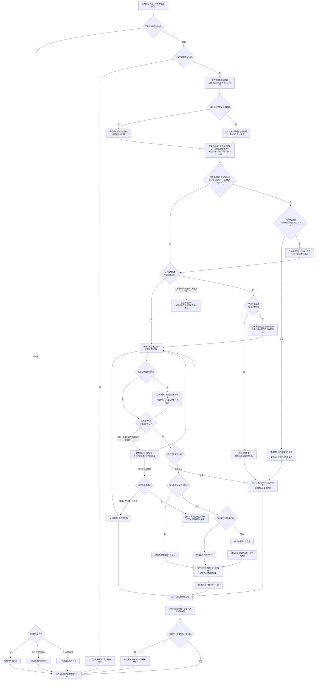

多个可写子代理可以并行，这不是单写入者规则；同一物理文件没有真实隔离时只允许一条
直接写入路线。子代理通过父代理给出的规范任务名和内部父子消息单独发送声明，在自己的任务
界面公开同一四行，并在最终回复顶部再次写实际配置；三处与读取、分析、工具调用和真实工作
不设固定先后。公开副本不能冒充内部父子消息。声明不是关键步骤，也不等待确认。关键步骤必须是父代理
派发时列出的有限阶段；消息发出后
子代理立即继续，父代理只异步快判，不建立确认往返。插件不增加认领数据库、锁租约、定时
心跳或后台协调器。父代理工具表不代表子代理工具表；只有收到当前子代理的内部
`agent_message` 才确认路线可用。内部工具不可用且中途交流不可缺少时立即停止这条子任务；
完全自包含的有限任务才可在自身线程继续，不能冒充内部消息。
协作父代理只在任务卡明确允许、真实工具可用且下游边界能隔离时出现；它可以核验并整合自己
子树的独立结果，但不能压掉、改写或冒充下游最终回复。跨任务调用或新建 Codex 父代理任务
属于用户可见编排，符合三项原则和当前持续授权时可直接进入，并指定唯一整合父代理；
`send_message_to_thread` 不能冒充内部 `collaboration.send_message`。完整规则见
[协作父代理与父代理之间](collaboration.md)。

## 三、调用容量与成本快判链路

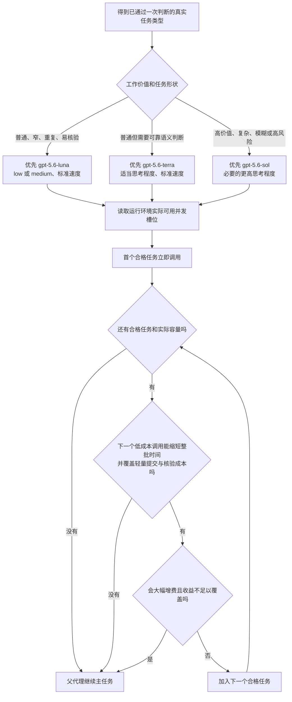

插件不设置同时调用数字，也不设置主任务累计调用数字。容量是上限，不是调用目标；固定
成本预估既提供普通任务的低成本正向选路，也阻止无相应收益的大幅增费；不逐任务搜索
费率、计算令牌或制作评分表。某个低成本子任务不达标时只升级该子任务；所有路线默认标准
速度，真实关键路径收益足以覆盖加价时才使用快速速度。

## 四、固定成本预估与每周检查链路

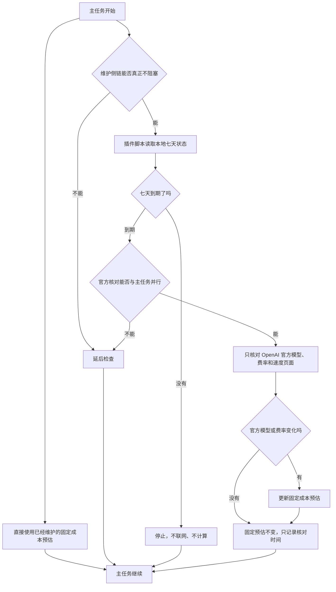

检查不创建 Codex 自动化、系统定时任务、外部守护进程，也不为维护单独调用子代理。

## 五、任务类型组、复制、变体与保留子代理链路

```mermaid
flowchart TD
    A[父代理已判定具体任务类型<br/>并确认应该调用] --> B{具体任务类型适合<br/>已有任务类型组吗}
    B -->|适合| C[立即复用已有任务类型组]
    C --> D{有可见的保留子代理吗}
    D -->|有| E[立即复用保留子代理]
    E --> F[保留子代理读取自己的<br/>经验和已有配置]
    D -->|没有| G[父代理为当前任务<br/>定制运行时新子代理]
    B -->|不适合| H[开新的运行时任务类型组]
    H --> G
    G --> I[父代理按任务类型联合选择<br/>模型、思考程度和速度完整配置]
    F --> J0[父代理为每个子任务分别给出规范任务名<br/>有限关键步骤清单和停止条件]
    I --> J0
    J0 --> JC{子代理实际有<br/>内部消息工具吗}
    JC -->|有| K
    JC -. 当前子任务中完成，不限顺序 .-> J[发送内部四行<br/>并在自身任务界面公开同一四行]
    JC -->|没有| JS{中途内部交流<br/>是成功条件吗}
    JS -->|是| JSTOP[停止真实任务<br/>自身线程报告能力缺口]
    JS -->|否| JSELF[仅做完全自包含的有限任务<br/>自身线程声明不冒充内部消息]
    K[组内子代理开始执行第一个子任务<br/>不等待声明确认]
    JSELF --> K
    JSTOP --> U
    K --> L[同一种活<br/>等于同一任务类型]
    L --> L1[父代理为每个子任务<br/>分别指定成功条件]
    L1 --> M{还有第二个或后续<br/>已就绪的同类型子任务吗}
    M -->|有| N[复制任务类型组里的基准子代理<br/>不是复制任务类型组]
    N --> O{可见保留子代理<br/>确有进步空间吗}
    O -->|没有| P[普通复制<br/>沿用已有配置和经验]
    O -->|有| Q[父代理联合选择完整可行配置组合<br/>让本次复制成为变体]
    P --> S{还有第三个或后续<br/>同类型子任务吗}
    Q --> S
    P -. 当前子任务中完成，不限顺序 .-> R[复制子代理发送内部四行<br/>并在自身界面公开同一四行]
    Q -. 当前子任务中完成，不限顺序 .-> R
    S -->|有| N
    S -->|没有| T[各子代理执行自己的<br/>有限关键步骤清单]
    M -->|没有| T
    T --> T0{达到各自成功条件<br/>或停止条件了吗}
    T0 -->|没有，完成关键步骤或发现新风险| TP[简短概述后立即继续<br/>不等待父代理]
    TP --> T
    TP -. 父代理异步快判 .-> TC{发现方向问题吗}
    TC -->|有| TU[立即纠偏或更新当前目标<br/>不扩权、不移除停止条件]
    TU --> T
    TC -->|没有| T
    T0 -->|是| U[最终回复顶部再次写实际配置<br/>提交自己的精炼结果]
    U -. 父代理仍要测试且有空闲容量 .-> UP[并行启动有限只读经验准备<br/>不写 SQLite，父代理不等待]
    U --> UA[父代理分别核验和使用<br/>不由子代理预先合并]
    UA --> U1[本组当前已就绪结果<br/>已经全部完成必要核验]
    U1 --> U2{本组出现过<br/>复制或变体吗}
    U2 -->|是| U3[全部子代理使用各自核验后的<br/>可比较证据竞争]
    U3 --> U4[选出同一任务类型组<br/>唯一留下的子代理]
    U2 -->|否| U4
    U4 --> V0{本组有配置变体吗}
    V0 -->|没有| W[保留唯一子代理对应的配置]
    V0 -->|有| V{胜出完整配置组合<br/>质量、耗时和成本更优吗}
    V -->|没有| W
    V -->|有| X[选择胜出变体配置作为保留配置]
    W --> Y[唯一子代理和对应配置已经确定]
    X --> Y
    Y --> Z{结果核验采用<br/>且没有明确排除项吗}
    Z -->|否| YSKIP[角色和经验跳过<br/>保存回执写明原因]
    Z -->|是| AB{该任务类型组的<br/>保留记录状态}
    AB -->|不存在| AD[第一次成功默认只尝试一次 ensure<br/>创建休眠配置]
    AB -->|配置相同| AE[复用现有保留子代理]
    AB -->|胜出配置不同| AF[先返回需要安全重配]
    AF --> AG[用当前哈希比较并交换]
    AG --> AH[保留身份、路径、所有权令牌和全部经验]
    AD --> AS{本次短写能立即<br/>安全完成吗}
    AE --> AS
    AH --> AS
    AS -->|否| YSKIP
    AS -->|是| AI[以后新任务生成新线程<br/>加载休眠配置并验证内部消息]
    AI --> AIR[结果核验采用且线程 Done<br/>UUID record-run 幂等增加存活轮次]
    AIR --> EX{有新增、去敏、非重复的<br/>可复用经验吗}
    EX -->|是| EI[复用稳定 event_id<br/>一次 improve 合并追加一条经验]
    EX -->|否| ENO[经验跳过<br/>保存回执写明原因]
    YSKIP --> Y2{本组出现过<br/>复制或变体吗}
    EI --> Y2
    ENO --> Y2
    Y2 -->|是| Y3[其他子代理移出组、结束<br/>并从运行时候选中消除]
    Y2 -->|否| Y4[不存在需要竞争移除的子代理]
    Y3 --> Y5[组内只剩一个子代理<br/>运行线程结束并进入 Done]
    Y4 --> Y5
    Y5 --> AC[每个合格任务类型组各有一个休眠配置<br/>不同组可同时跨任务保留多个]
```

定制运行时新子代理不等于持久创建，不先调用 `ensure`。子代理结果可采用且父代理仍要测试
时，有空闲容量可并行启动只读经验准备，父代理不等待；准备只是优化。唯一子代理的结果通过
必要核验并被采用后，第一次成功默认只尝试一次 `ensure`，并用稳定 `event_id` 默认一次
`improve` 追加一条新增、去敏、非重复的可复用经验。当前任务不轮询、不重新加载、不重启；运行线程
结束进入 Done，跨任务保留的是休眠配置。TOML 重配前已经创建的旧线程不会刷新提示；
`followup_task` 复用旧线程不能作为新配置证据，必须由以后新任务生成新线程验证。复制的是
任务类型组里的子代理，不是任务类型
组；复制只处理同一任务类型的第二个及以后子任务。变体只能在复制组内子代理时由父代理按
任务类型联合选择完整的模型、思考程度和速度组合；三个字段可以因相互制约而同时变化，单轴
变化只在明确需要识别因果时作为可选实验。只要
出现复制或变体，就在本组当前已就绪结果完成核验后先竞争并选出唯一子代理，再执行默认跨任务
保留和经验提交，最后才
把其他子代理移出组、结束并消除。不存在竞争的组也在结束位置执行同一经验维护判断。复制
和变体都不写入 SQLite 候选状态；每个子代理完成预设关键步骤后简短概述并立即继续，父代理
无异议时沉默或一行答复，有问题立即纠偏。达到成功条件或停止条件并自检后，每个子代理在
自己的线程用最终回复提交精炼结果，回复顶部再次写实际模型、思考程度和速度；竞争不延迟或替代
这些结果。
父代理只有真实收到当前子代理的内部 `agent_message` 才确认交流可用；没有内部工具时，
中途交流是成功条件就停止该子任务并报告运行环境缺口，不得改用跨任务 API，也不得仅为通信
升级模型或增加成本。只有完全自包含的有限子任务可在自身线程继续。结果核验采用并进入 Done
后，才用任务说明中的 UUID 幂等记录一次存活轮次。结果未通过或未采用、用户否定、无法安全
去敏，或者权限、安全、SQLite、文件、身份、CAS 失败时安全跳过；没有空闲容量、准备未赶上、
没有剩余收口工作或主任务已经满足都不能取消默认有界尝试。父代理最终按组给出保存回执。

## 六、调查与实现链路

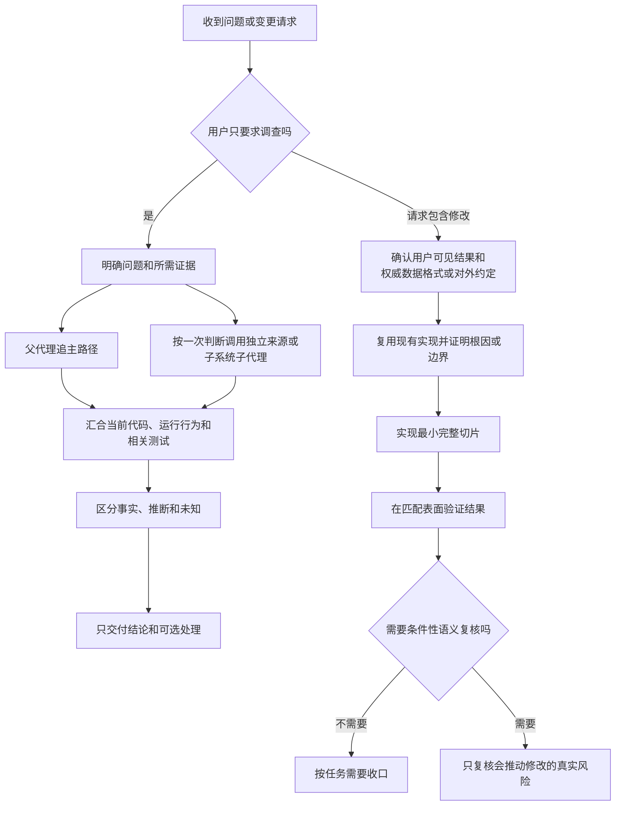

来源覆盖完整且来源未变化时，父代理不重复完整读取。

## 七、迭代测试链路


几秒的确定性测试由父代理直接运行；没有独立语义收益时不调用验证子代理。

## 八、条件性语义复核与最终验证链路


语义复核不是所有主任务固定经过的重点链路。

## 九、失败后的最窄重验链路

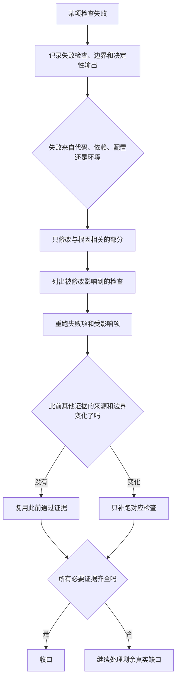

## 十、经验转移、只追加与摘要压缩链路

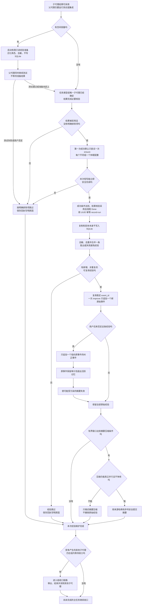

默认保留和原始经验提交不要求主任务接近结束、剩余收口工作或并行窗口；每次只做一次有界
本地尝试，不排队、不轮询、不重试，主任务不依赖成功。准备未开始或未赶上不取消正式提交。
摘要压缩仍只在能真正并行且不争用时执行；推迟摘要不能撤销原始经验。原始经验数量不封顶，
摘要压缩和纠正永不删除原始经验。竞争组先确定唯一子代理，再执行本链；本链完成或安全跳过
之后才移出其他子代理。没有竞争的组也从同一个组结束位置进入本链。

## 十一、SQLite 结构拒绝链路

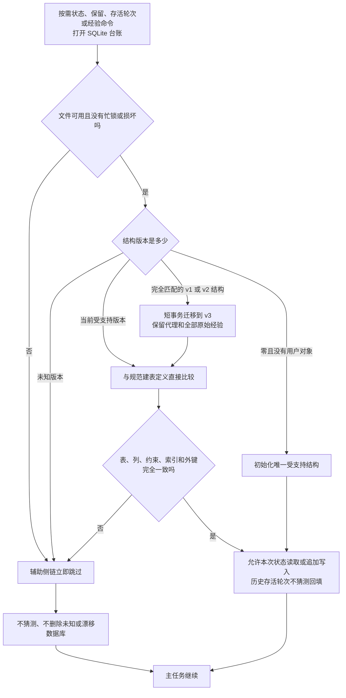

SQLite 不用于认领源码文件、锁定工作区或协调可写子代理。

## 十二、任务类型组收口、精确删除与否定重做链路

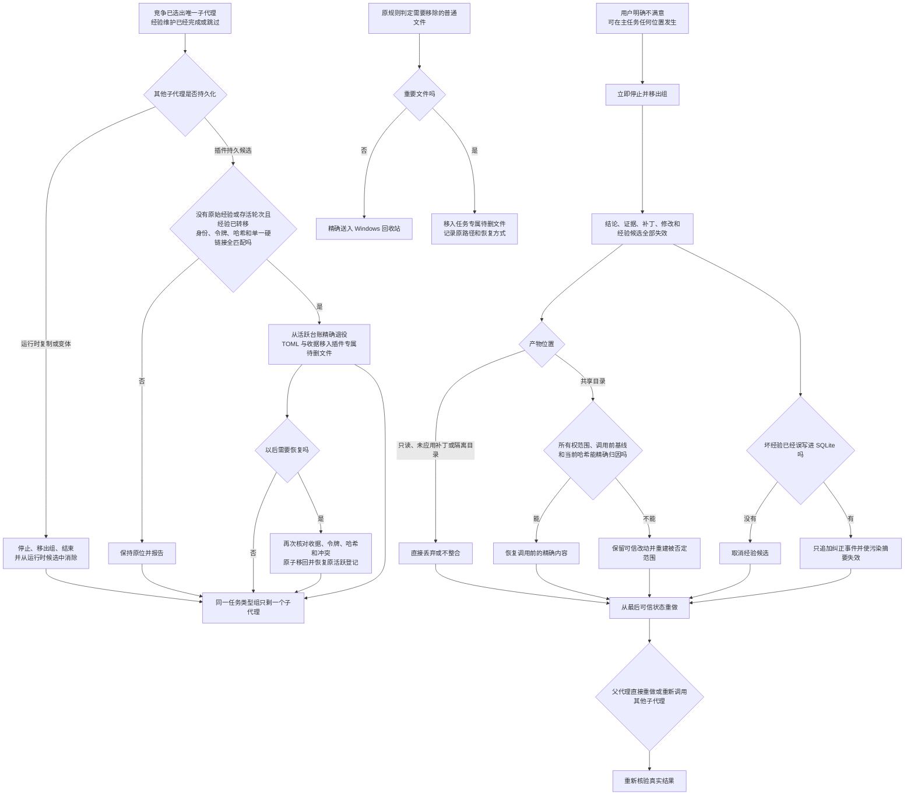

最近的协作授权不改变删除、删减或候选清理尺度。原规则判定应移除的普通文件进入 Windows
回收站，重要文件进入 `待删文件`；插件持久候选仍按原来的经验、存活轮次、身份、令牌、哈希
和单一硬链接资格判断，合格时进入 `<CODEX_HOME>/lean-stack/待删文件`，不再永久 `unlink`。
用户不满意本身不能放宽资格。Codex 已显示的历史文字不能由插件物理删除，被否定内容只能从
当前工作和最终交付中排除。

## 十三、版本、校验与本地重装链路

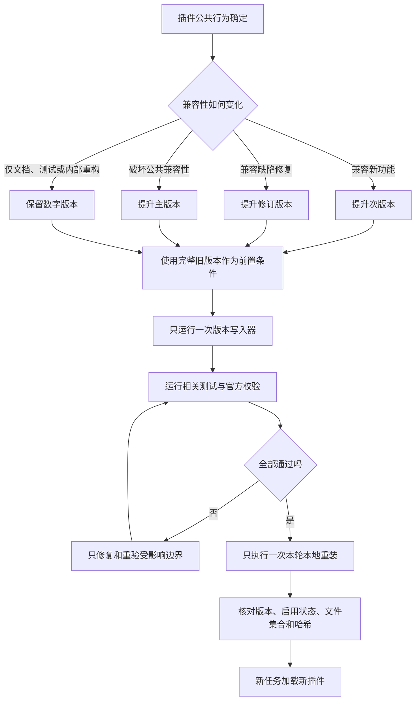

提交、推送、公开发布、外部消息、修改用户全局 `AGENTS.md` 和重启应用，不由本链路
自动授权。

## 系统标识

普通中文正文使用统一中文术语。必须与运行环境或脚本精确交互时，才单独使用：

```text
worker
explorer
SOURCE_COVERAGE
agents.enabled
agents.max_concurrent_threads_per_session
expected_sha256
run_id
status
ensure
record-run
improve
delete
```
